# 《边界回声》第一集视频生成复制表｜OP06-OP12

用途：生成第一集事故核心段 OP06-OP12 图生视频时，直接打开本文件，按每个分镜复制关键帧图片路径和对应 Prompt。

说明：本版只收录当前已质检可用的 `op06_op12_director_v1` 关键帧。OP01-OP05 和 OP13-OP30 素材版本较分散，暂不混入本表，避免生成时误用旧图。

## 使用流程

1. 每次只生成一个分镜短段。
2. 上传本条关键帧图片。
3. 复制本条 `图生视频 Prompt`。
4. 如果软件有负面提示词栏，复制本条 `负面约束`。
5. 对白后期配音，画面不要生成字幕，不要求精准口型。

## 全局风格锁

```text
高精度写实 CG 渲染风，电影级悬疑情绪短剧镜头。事故当天午后静海旧北站，暖光候车大厅逐渐被冷白系统警报切开，玻璃顶棚、高窗、闸机、长椅、电子屏、中央时钟、正常人群逐步转为混乱。镜头运动克制，像真实电影摄影机，不做夸张变焦、漂浮运镜或游戏过场。人物动作以眼神、手部、停顿、保护动作和短促移动为主。保持小夏 6-7 岁东亚小女孩、黑色低位小马尾、淡粉儿童连帽外套、小书包；妈妈 30 岁左右东亚女性、黑色低发髻、浅卡其灰外套、斜挎包、温柔但清醒。OP09 起小夏右脚鞋脱落，只穿白袜，左脚仍穿淡粉米白儿童鞋。OP10-OP12 隔离门必须是两米以上高长连续玻璃与金属分区墙，从地面升起，横向贯穿大厅，不是短栏杆或闸机。
```

## 通用负面约束

```text
不要字幕，不要可读文字，不要水印，不要 logo，不要血腥，不要肢体伤害特写，不要夸张火球，不要恐怖鬼脸，不要二次元萌系，不要动画剧集风，不要真实偷拍感，不要换脸，不要换服装，不要多余手指，不要畸形手，不要把小夏年龄画大，不要把妈妈画成冷漠逃跑。OP09 之后不要让小夏右脚重新穿鞋。OP10-OP12 不要短栏杆、闸机、小门、可绕过隔断。妈妈松手只能是保护性松手，绝不能表现成放弃、推开、转身离开或冷漠逃走。
```

---

## OP06｜第一次异常前兆

### OP06-1｜母女在午后旧北站继续牵手前行，暖光仍然正常，人群自然流动

关键帧图片：

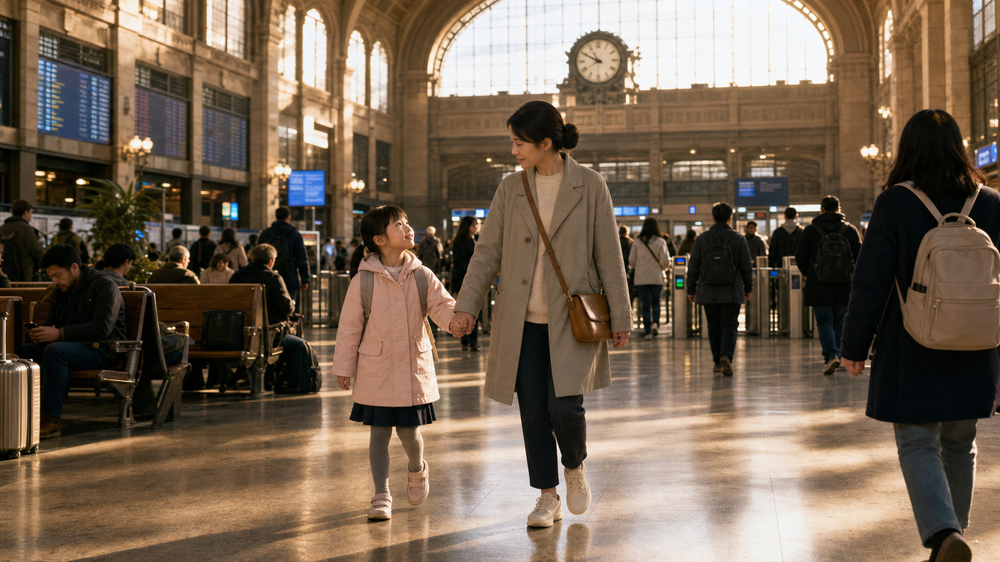

图片路径：

```text
F:\CodexSharedCockpit\episodes\season_01\episode_01\keyframes\op06_op12_director_v1\OP06-1_日常牵手继续前行_关键帧_v1.png
```

图生视频 Prompt：

```text
高精度写实 CG 渲染风，电影级悬疑情绪短剧镜头。事故当天午后静海旧北站，暖光候车大厅逐渐被冷白系统警报切开，玻璃顶棚、高窗、闸机、长椅、电子屏、中央时钟、正常人群逐步转为混乱。镜头运动克制，像真实电影摄影机，不做夸张变焦、漂浮运镜或游戏过场。人物动作以眼神、手部、停顿、保护动作和短促移动为主。保持小夏 6-7 岁东亚小女孩、黑色低位小马尾、淡粉儿童连帽外套、小书包；妈妈 30 岁左右东亚女性、黑色低发髻、浅卡其灰外套、斜挎包、温柔但清醒。OP09 起小夏右脚鞋脱落，只穿白袜，左脚仍穿淡粉米白儿童鞋。OP10-OP12 隔离门必须是两米以上高长连续玻璃与金属分区墙，从地面升起，横向贯穿大厅，不是短栏杆或闸机。

本段分镜：OP06-1，第一次异常前兆。以关键帧构图、人物站位、服装、光线和背景结构为准。画面内容：母女在午后旧北站继续牵手前行，暖光仍然正常，人群自然流动，小夏两只鞋都在。 镜头运动：固定机位或极慢推近，让观众先感到普通一天还没有完全破裂。 动作只围绕这一件事展开，不要自行换场景、换角度、增加新人物或跳到后续剧情。保持情绪克制、真实、可剪辑，最后 0.5 秒稳定在本分镜情绪落点，方便剪辑衔接。
```

负面约束：

```text
不要字幕，不要可读文字，不要水印，不要 logo，不要血腥，不要肢体伤害特写，不要夸张火球，不要恐怖鬼脸，不要二次元萌系，不要动画剧集风，不要真实偷拍感，不要换脸，不要换服装，不要多余手指，不要畸形手，不要把小夏年龄画大，不要把妈妈画成冷漠逃跑。OP09 之后不要让小夏右脚重新穿鞋。OP10-OP12 不要短栏杆、闸机、小门、可绕过隔断。妈妈松手只能是保护性松手，绝不能表现成放弃、推开、转身离开或冷漠逃走。
```

### OP06-2｜远处电子屏出现一条冷白横向故障线，顶部灯暗一瞬又恢复，母

关键帧图片：

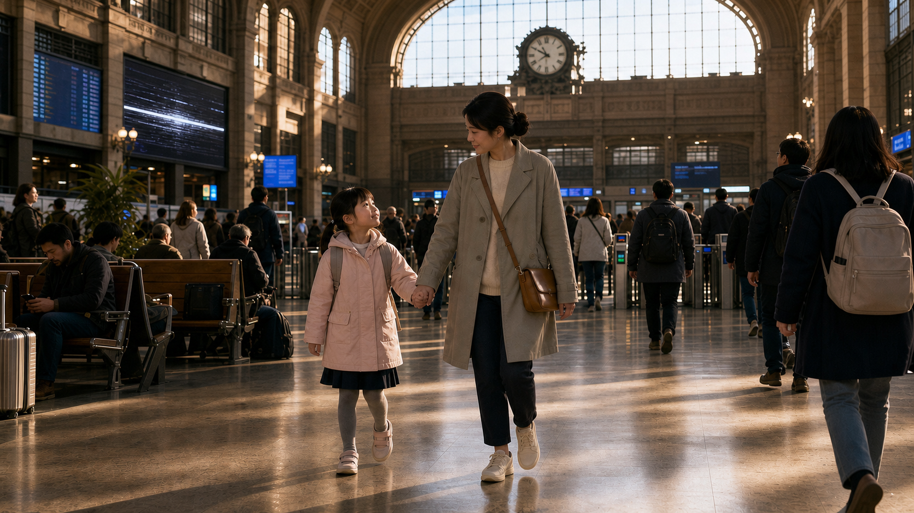

图片路径：

```text
F:\CodexSharedCockpit\episodes\season_01\episode_01\keyframes\op06_op12_director_v1\OP06-2_电子屏冷白故障线_关键帧_v1.png
```

图生视频 Prompt：

```text
高精度写实 CG 渲染风，电影级悬疑情绪短剧镜头。事故当天午后静海旧北站，暖光候车大厅逐渐被冷白系统警报切开，玻璃顶棚、高窗、闸机、长椅、电子屏、中央时钟、正常人群逐步转为混乱。镜头运动克制，像真实电影摄影机，不做夸张变焦、漂浮运镜或游戏过场。人物动作以眼神、手部、停顿、保护动作和短促移动为主。保持小夏 6-7 岁东亚小女孩、黑色低位小马尾、淡粉儿童连帽外套、小书包；妈妈 30 岁左右东亚女性、黑色低发髻、浅卡其灰外套、斜挎包、温柔但清醒。OP09 起小夏右脚鞋脱落，只穿白袜，左脚仍穿淡粉米白儿童鞋。OP10-OP12 隔离门必须是两米以上高长连续玻璃与金属分区墙，从地面升起，横向贯穿大厅，不是短栏杆或闸机。

本段分镜：OP06-2，第一次异常前兆。以关键帧构图、人物站位、服装、光线和背景结构为准。画面内容：远处电子屏出现一条冷白横向故障线，顶部灯暗一瞬又恢复，母女仍在画面里牵手。 镜头运动：镜头轻轻偏向电子屏方向，异常只是一闪，不进入正式灾难。 动作只围绕这一件事展开，不要自行换场景、换角度、增加新人物或跳到后续剧情。保持情绪克制、真实、可剪辑，最后 0.5 秒稳定在本分镜情绪落点，方便剪辑衔接。
```

负面约束：

```text
不要字幕，不要可读文字，不要水印，不要 logo，不要血腥，不要肢体伤害特写，不要夸张火球，不要恐怖鬼脸，不要二次元萌系，不要动画剧集风，不要真实偷拍感，不要换脸，不要换服装，不要多余手指，不要畸形手，不要把小夏年龄画大，不要把妈妈画成冷漠逃跑。OP09 之后不要让小夏右脚重新穿鞋。OP10-OP12 不要短栏杆、闸机、小门、可绕过隔断。妈妈松手只能是保护性松手，绝不能表现成放弃、推开、转身离开或冷漠逃走。
```

### OP06-3｜少数乘客疑惑抬头，大多数人仍继续移动，车站还没有混乱。

关键帧图片：

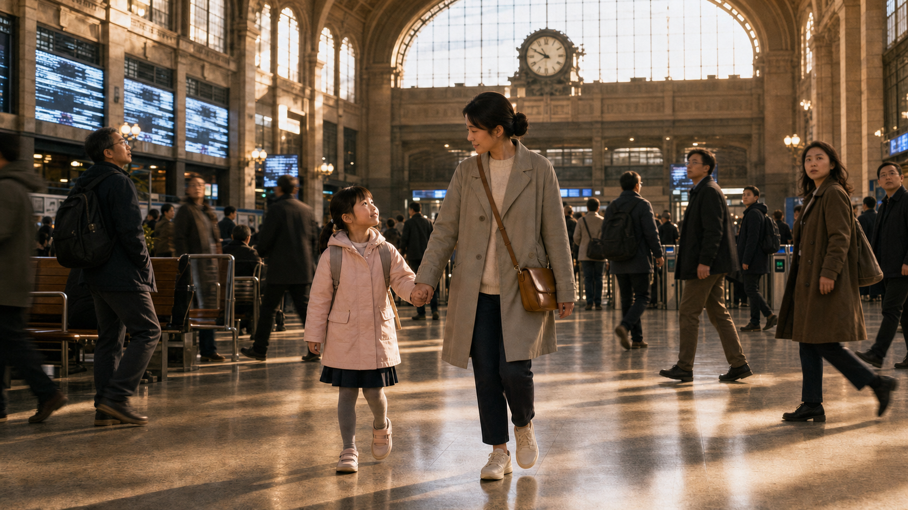

图片路径：

```text
F:\CodexSharedCockpit\episodes\season_01\episode_01\keyframes\op06_op12_director_v1\OP06-3_少数乘客疑惑抬头_关键帧_v1.png
```

图生视频 Prompt：

```text
高精度写实 CG 渲染风，电影级悬疑情绪短剧镜头。事故当天午后静海旧北站，暖光候车大厅逐渐被冷白系统警报切开，玻璃顶棚、高窗、闸机、长椅、电子屏、中央时钟、正常人群逐步转为混乱。镜头运动克制，像真实电影摄影机，不做夸张变焦、漂浮运镜或游戏过场。人物动作以眼神、手部、停顿、保护动作和短促移动为主。保持小夏 6-7 岁东亚小女孩、黑色低位小马尾、淡粉儿童连帽外套、小书包；妈妈 30 岁左右东亚女性、黑色低发髻、浅卡其灰外套、斜挎包、温柔但清醒。OP09 起小夏右脚鞋脱落，只穿白袜，左脚仍穿淡粉米白儿童鞋。OP10-OP12 隔离门必须是两米以上高长连续玻璃与金属分区墙，从地面升起，横向贯穿大厅，不是短栏杆或闸机。

本段分镜：OP06-3，第一次异常前兆。以关键帧构图、人物站位、服装、光线和背景结构为准。画面内容：少数乘客疑惑抬头，大多数人仍继续移动，车站还没有混乱。 镜头运动：轻微横移扫过人群，保持生活流动感，不能全员静止。 动作只围绕这一件事展开，不要自行换场景、换角度、增加新人物或跳到后续剧情。保持情绪克制、真实、可剪辑，最后 0.5 秒稳定在本分镜情绪落点，方便剪辑衔接。
```

负面约束：

```text
不要字幕，不要可读文字，不要水印，不要 logo，不要血腥，不要肢体伤害特写，不要夸张火球，不要恐怖鬼脸，不要二次元萌系，不要动画剧集风，不要真实偷拍感，不要换脸，不要换服装，不要多余手指，不要畸形手，不要把小夏年龄画大，不要把妈妈画成冷漠逃跑。OP09 之后不要让小夏右脚重新穿鞋。OP10-OP12 不要短栏杆、闸机、小门、可绕过隔断。妈妈松手只能是保护性松手，绝不能表现成放弃、推开、转身离开或冷漠逃走。
```

### OP06-4｜小夏抬头看妈妈，眼神疑惑但还没有哭，手仍被妈妈握着。

关键帧图片：

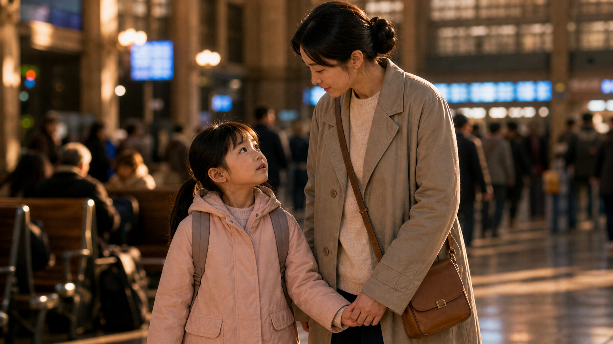

图片路径：

```text
F:\CodexSharedCockpit\episodes\season_01\episode_01\keyframes\op06_op12_director_v1\OP06-4_小夏抬头看妈妈疑惑_同背景修正版_v2.png
```

图生视频 Prompt：

```text
高精度写实 CG 渲染风，电影级悬疑情绪短剧镜头。事故当天午后静海旧北站，暖光候车大厅逐渐被冷白系统警报切开，玻璃顶棚、高窗、闸机、长椅、电子屏、中央时钟、正常人群逐步转为混乱。镜头运动克制，像真实电影摄影机，不做夸张变焦、漂浮运镜或游戏过场。人物动作以眼神、手部、停顿、保护动作和短促移动为主。保持小夏 6-7 岁东亚小女孩、黑色低位小马尾、淡粉儿童连帽外套、小书包；妈妈 30 岁左右东亚女性、黑色低发髻、浅卡其灰外套、斜挎包、温柔但清醒。OP09 起小夏右脚鞋脱落，只穿白袜，左脚仍穿淡粉米白儿童鞋。OP10-OP12 隔离门必须是两米以上高长连续玻璃与金属分区墙，从地面升起，横向贯穿大厅，不是短栏杆或闸机。

本段分镜：OP06-4，第一次异常前兆。以关键帧构图、人物站位、服装、光线和背景结构为准。画面内容：小夏抬头看妈妈，眼神疑惑但还没有哭，手仍被妈妈握着。 镜头运动：缓慢推近小夏脸部，留后期短句时间槽，不要求口型。 动作只围绕这一件事展开，不要自行换场景、换角度、增加新人物或跳到后续剧情。保持情绪克制、真实、可剪辑，最后 0.5 秒稳定在本分镜情绪落点，方便剪辑衔接。
```

负面约束：

```text
不要字幕，不要可读文字，不要水印，不要 logo，不要血腥，不要肢体伤害特写，不要夸张火球，不要恐怖鬼脸，不要二次元萌系，不要动画剧集风，不要真实偷拍感，不要换脸，不要换服装，不要多余手指，不要畸形手，不要把小夏年龄画大，不要把妈妈画成冷漠逃跑。OP09 之后不要让小夏右脚重新穿鞋。OP10-OP12 不要短栏杆、闸机、小门、可绕过隔断。妈妈松手只能是保护性松手，绝不能表现成放弃、推开、转身离开或冷漠逃走。
```

### OP06-5｜妈妈把小夏往身边拉近，脸上压住不安，仍温柔稳定。

关键帧图片：

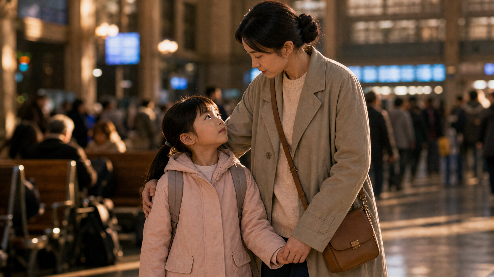

图片路径：

```text
F:\CodexSharedCockpit\episodes\season_01\episode_01\keyframes\op06_op12_director_v1\OP06-5_妈妈把小夏拉近安抚_同背景修正版_v2.png
```

图生视频 Prompt：

```text
高精度写实 CG 渲染风，电影级悬疑情绪短剧镜头。事故当天午后静海旧北站，暖光候车大厅逐渐被冷白系统警报切开，玻璃顶棚、高窗、闸机、长椅、电子屏、中央时钟、正常人群逐步转为混乱。镜头运动克制，像真实电影摄影机，不做夸张变焦、漂浮运镜或游戏过场。人物动作以眼神、手部、停顿、保护动作和短促移动为主。保持小夏 6-7 岁东亚小女孩、黑色低位小马尾、淡粉儿童连帽外套、小书包；妈妈 30 岁左右东亚女性、黑色低发髻、浅卡其灰外套、斜挎包、温柔但清醒。OP09 起小夏右脚鞋脱落，只穿白袜，左脚仍穿淡粉米白儿童鞋。OP10-OP12 隔离门必须是两米以上高长连续玻璃与金属分区墙，从地面升起，横向贯穿大厅，不是短栏杆或闸机。

本段分镜：OP06-5，第一次异常前兆。以关键帧构图、人物站位、服装、光线和背景结构为准。画面内容：妈妈把小夏往身边拉近，脸上压住不安，仍温柔稳定。 镜头运动：妈妈动作轻而坚定，是安抚不是慌乱。 动作只围绕这一件事展开，不要自行换场景、换角度、增加新人物或跳到后续剧情。保持情绪克制、真实、可剪辑，最后 0.5 秒稳定在本分镜情绪落点，方便剪辑衔接。
```

负面约束：

```text
不要字幕，不要可读文字，不要水印，不要 logo，不要血腥，不要肢体伤害特写，不要夸张火球，不要恐怖鬼脸，不要二次元萌系，不要动画剧集风，不要真实偷拍感，不要换脸，不要换服装，不要多余手指，不要畸形手，不要把小夏年龄画大，不要把妈妈画成冷漠逃跑。OP09 之后不要让小夏右脚重新穿鞋。OP10-OP12 不要短栏杆、闸机、小门、可绕过隔断。妈妈松手只能是保护性松手，绝不能表现成放弃、推开、转身离开或冷漠逃走。
```

### OP06-6｜母女一起看向电子屏，中远景，暖光与一丝冷白故障光混合。

关键帧图片：

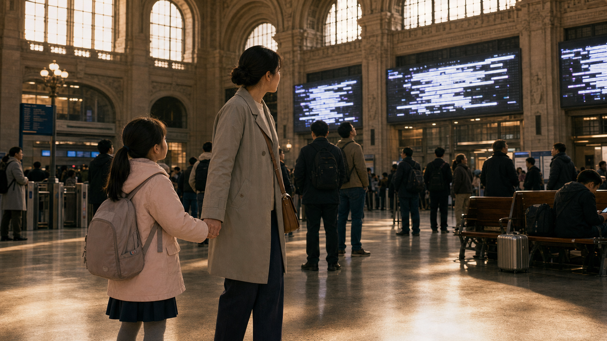

图片路径：

```text
F:\CodexSharedCockpit\episodes\season_01\episode_01\keyframes\op06_op12_director_v1\OP06-6_母女共同看向故障屏_关键帧_v1.png
```

图生视频 Prompt：

```text
高精度写实 CG 渲染风，电影级悬疑情绪短剧镜头。事故当天午后静海旧北站，暖光候车大厅逐渐被冷白系统警报切开，玻璃顶棚、高窗、闸机、长椅、电子屏、中央时钟、正常人群逐步转为混乱。镜头运动克制，像真实电影摄影机，不做夸张变焦、漂浮运镜或游戏过场。人物动作以眼神、手部、停顿、保护动作和短促移动为主。保持小夏 6-7 岁东亚小女孩、黑色低位小马尾、淡粉儿童连帽外套、小书包；妈妈 30 岁左右东亚女性、黑色低发髻、浅卡其灰外套、斜挎包、温柔但清醒。OP09 起小夏右脚鞋脱落，只穿白袜，左脚仍穿淡粉米白儿童鞋。OP10-OP12 隔离门必须是两米以上高长连续玻璃与金属分区墙，从地面升起，横向贯穿大厅，不是短栏杆或闸机。

本段分镜：OP06-6，第一次异常前兆。以关键帧构图、人物站位、服装、光线和背景结构为准。画面内容：母女一起看向电子屏，中远景，暖光与一丝冷白故障光混合。 镜头运动：画面末尾让环境声压低，为 OP07 正式警报做声音桥。 动作只围绕这一件事展开，不要自行换场景、换角度、增加新人物或跳到后续剧情。保持情绪克制、真实、可剪辑，最后 0.5 秒稳定在本分镜情绪落点，方便剪辑衔接。
```

负面约束：

```text
不要字幕，不要可读文字，不要水印，不要 logo，不要血腥，不要肢体伤害特写，不要夸张火球，不要恐怖鬼脸，不要二次元萌系，不要动画剧集风，不要真实偷拍感，不要换脸，不要换服装，不要多余手指，不要畸形手，不要把小夏年龄画大，不要把妈妈画成冷漠逃跑。OP09 之后不要让小夏右脚重新穿鞋。OP10-OP12 不要短栏杆、闸机、小门、可绕过隔断。妈妈松手只能是保护性松手，绝不能表现成放弃、推开、转身离开或冷漠逃走。
```

---

## OP07｜系统正式警报

### OP07-1｜电子屏故障增强，冷白闪烁明显，旧北站仍是事故当天午后候车

关键帧图片：

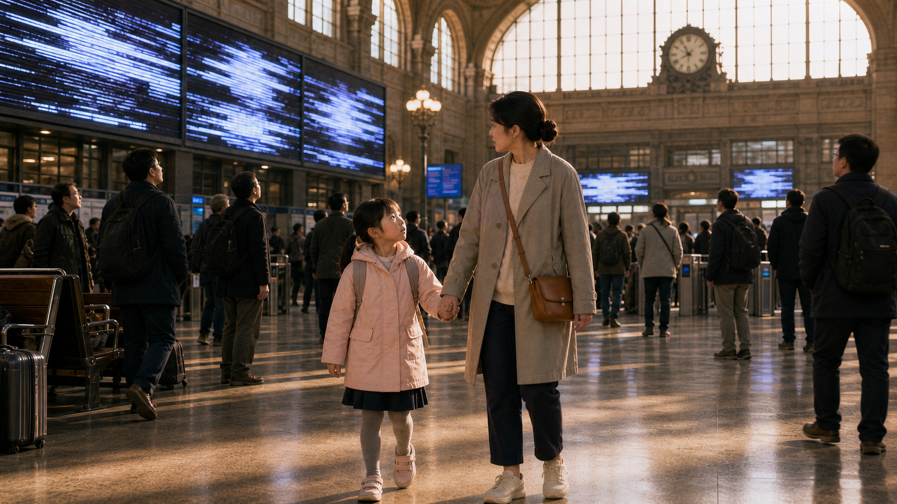

图片路径：

```text
F:\CodexSharedCockpit\episodes\season_01\episode_01\keyframes\op06_op12_director_v1\OP07-1_电子屏故障增强_关键帧_v1.png
```

图生视频 Prompt：

```text
高精度写实 CG 渲染风，电影级悬疑情绪短剧镜头。事故当天午后静海旧北站，暖光候车大厅逐渐被冷白系统警报切开，玻璃顶棚、高窗、闸机、长椅、电子屏、中央时钟、正常人群逐步转为混乱。镜头运动克制，像真实电影摄影机，不做夸张变焦、漂浮运镜或游戏过场。人物动作以眼神、手部、停顿、保护动作和短促移动为主。保持小夏 6-7 岁东亚小女孩、黑色低位小马尾、淡粉儿童连帽外套、小书包；妈妈 30 岁左右东亚女性、黑色低发髻、浅卡其灰外套、斜挎包、温柔但清醒。OP09 起小夏右脚鞋脱落，只穿白袜，左脚仍穿淡粉米白儿童鞋。OP10-OP12 隔离门必须是两米以上高长连续玻璃与金属分区墙，从地面升起，横向贯穿大厅，不是短栏杆或闸机。

本段分镜：OP07-1，系统正式警报。以关键帧构图、人物站位、服装、光线和背景结构为准。画面内容：电子屏故障增强，冷白闪烁明显，旧北站仍是事故当天午后候车大厅。 镜头运动：轻微推近电子屏方向，故障增强但不要出现可读大段文字。 动作只围绕这一件事展开，不要自行换场景、换角度、增加新人物或跳到后续剧情。保持情绪克制、真实、可剪辑，最后 0.5 秒稳定在本分镜情绪落点，方便剪辑衔接。
```

负面约束：

```text
不要字幕，不要可读文字，不要水印，不要 logo，不要血腥，不要肢体伤害特写，不要夸张火球，不要恐怖鬼脸，不要二次元萌系，不要动画剧集风，不要真实偷拍感，不要换脸，不要换服装，不要多余手指，不要畸形手，不要把小夏年龄画大，不要把妈妈画成冷漠逃跑。OP09 之后不要让小夏右脚重新穿鞋。OP10-OP12 不要短栏杆、闸机、小门、可绕过隔断。妈妈松手只能是保护性松手，绝不能表现成放弃、推开、转身离开或冷漠逃走。
```

### OP07-2｜少量警示灯亮起，人群停顿回头，红光只是少量点缀。

关键帧图片：

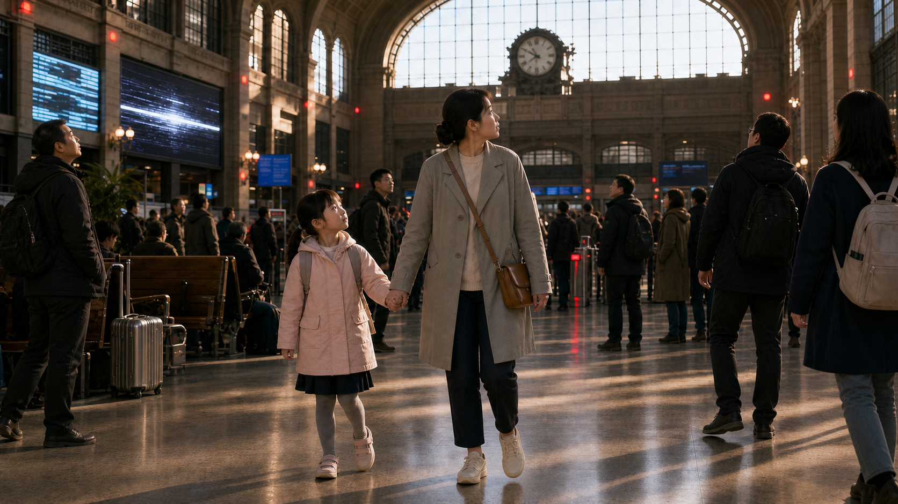

图片路径：

```text
F:\CodexSharedCockpit\episodes\season_01\episode_01\keyframes\op06_op12_director_v1\OP07-2_少量警示灯亮起_关键帧_v1.png
```

图生视频 Prompt：

```text
高精度写实 CG 渲染风，电影级悬疑情绪短剧镜头。事故当天午后静海旧北站，暖光候车大厅逐渐被冷白系统警报切开，玻璃顶棚、高窗、闸机、长椅、电子屏、中央时钟、正常人群逐步转为混乱。镜头运动克制，像真实电影摄影机，不做夸张变焦、漂浮运镜或游戏过场。人物动作以眼神、手部、停顿、保护动作和短促移动为主。保持小夏 6-7 岁东亚小女孩、黑色低位小马尾、淡粉儿童连帽外套、小书包；妈妈 30 岁左右东亚女性、黑色低发髻、浅卡其灰外套、斜挎包、温柔但清醒。OP09 起小夏右脚鞋脱落，只穿白袜，左脚仍穿淡粉米白儿童鞋。OP10-OP12 隔离门必须是两米以上高长连续玻璃与金属分区墙，从地面升起，横向贯穿大厅，不是短栏杆或闸机。

本段分镜：OP07-2，系统正式警报。以关键帧构图、人物站位、服装、光线和背景结构为准。画面内容：少量警示灯亮起，人群停顿回头，红光只是少量点缀。 镜头运动：冷白系统光逐渐压过暖光，不要红光铺满。 动作只围绕这一件事展开，不要自行换场景、换角度、增加新人物或跳到后续剧情。保持情绪克制、真实、可剪辑，最后 0.5 秒稳定在本分镜情绪落点，方便剪辑衔接。
```

负面约束：

```text
不要字幕，不要可读文字，不要水印，不要 logo，不要血腥，不要肢体伤害特写，不要夸张火球，不要恐怖鬼脸，不要二次元萌系，不要动画剧集风，不要真实偷拍感，不要换脸，不要换服装，不要多余手指，不要畸形手，不要把小夏年龄画大，不要把妈妈画成冷漠逃跑。OP09 之后不要让小夏右脚重新穿鞋。OP10-OP12 不要短栏杆、闸机、小门、可绕过隔断。妈妈松手只能是保护性松手，绝不能表现成放弃、推开、转身离开或冷漠逃走。
```

### OP07-3｜乘客低声议论，有人回头看连廊方向，群体开始不安。

关键帧图片：

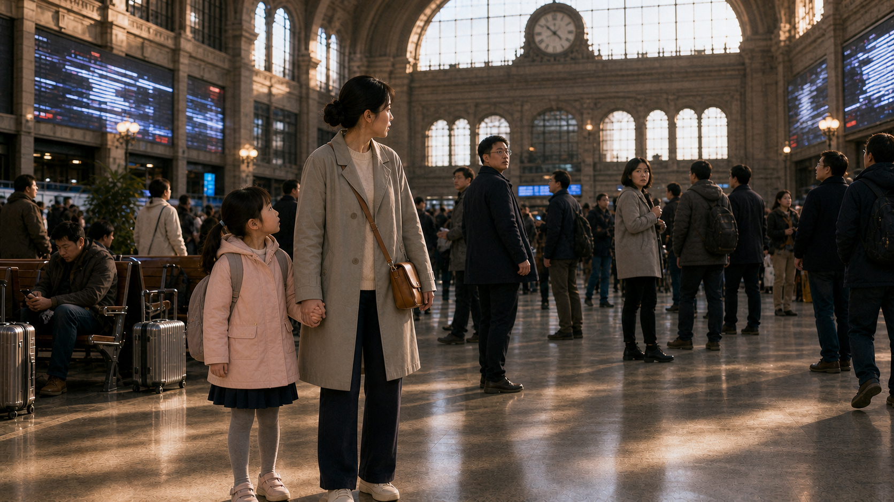

图片路径：

```text
F:\CodexSharedCockpit\episodes\season_01\episode_01\keyframes\op06_op12_director_v1\OP07-3_人群停顿低声议论_关键帧_v1.png
```

图生视频 Prompt：

```text
高精度写实 CG 渲染风，电影级悬疑情绪短剧镜头。事故当天午后静海旧北站，暖光候车大厅逐渐被冷白系统警报切开，玻璃顶棚、高窗、闸机、长椅、电子屏、中央时钟、正常人群逐步转为混乱。镜头运动克制，像真实电影摄影机，不做夸张变焦、漂浮运镜或游戏过场。人物动作以眼神、手部、停顿、保护动作和短促移动为主。保持小夏 6-7 岁东亚小女孩、黑色低位小马尾、淡粉儿童连帽外套、小书包；妈妈 30 岁左右东亚女性、黑色低发髻、浅卡其灰外套、斜挎包、温柔但清醒。OP09 起小夏右脚鞋脱落，只穿白袜，左脚仍穿淡粉米白儿童鞋。OP10-OP12 隔离门必须是两米以上高长连续玻璃与金属分区墙，从地面升起，横向贯穿大厅，不是短栏杆或闸机。

本段分镜：OP07-3，系统正式警报。以关键帧构图、人物站位、服装、光线和背景结构为准。画面内容：乘客低声议论，有人回头看连廊方向，群体开始不安。 镜头运动：中景群像微动，脚步放慢，仍不是奔跑混乱。 动作只围绕这一件事展开，不要自行换场景、换角度、增加新人物或跳到后续剧情。保持情绪克制、真实、可剪辑，最后 0.5 秒稳定在本分镜情绪落点，方便剪辑衔接。
```

负面约束：

```text
不要字幕，不要可读文字，不要水印，不要 logo，不要血腥，不要肢体伤害特写，不要夸张火球，不要恐怖鬼脸，不要二次元萌系，不要动画剧集风，不要真实偷拍感，不要换脸，不要换服装，不要多余手指，不要畸形手，不要把小夏年龄画大，不要把妈妈画成冷漠逃跑。OP09 之后不要让小夏右脚重新穿鞋。OP10-OP12 不要短栏杆、闸机、小门、可绕过隔断。妈妈松手只能是保护性松手，绝不能表现成放弃、推开、转身离开或冷漠逃走。
```

### OP07-4｜小夏看向妈妈，紧张但还没哭，两只鞋都在。

关键帧图片：

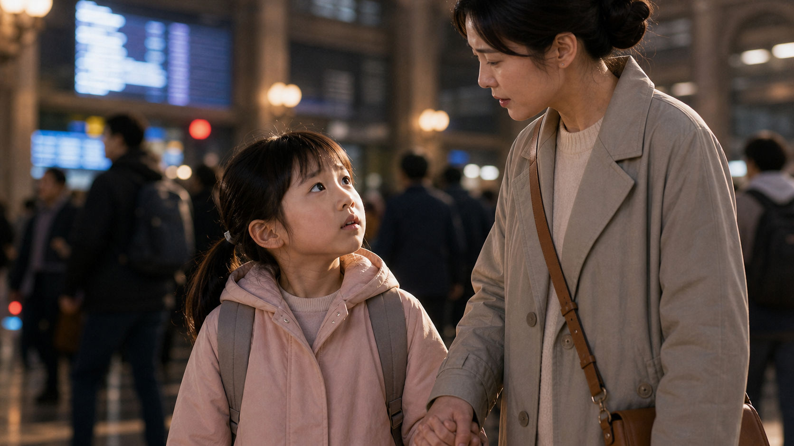

图片路径：

```text
F:\CodexSharedCockpit\episodes\season_01\episode_01\keyframes\op06_op12_director_v1\OP07-4_小夏问妈妈怎么了_关键帧_v1.png
```

图生视频 Prompt：

```text
高精度写实 CG 渲染风，电影级悬疑情绪短剧镜头。事故当天午后静海旧北站，暖光候车大厅逐渐被冷白系统警报切开，玻璃顶棚、高窗、闸机、长椅、电子屏、中央时钟、正常人群逐步转为混乱。镜头运动克制，像真实电影摄影机，不做夸张变焦、漂浮运镜或游戏过场。人物动作以眼神、手部、停顿、保护动作和短促移动为主。保持小夏 6-7 岁东亚小女孩、黑色低位小马尾、淡粉儿童连帽外套、小书包；妈妈 30 岁左右东亚女性、黑色低发髻、浅卡其灰外套、斜挎包、温柔但清醒。OP09 起小夏右脚鞋脱落，只穿白袜，左脚仍穿淡粉米白儿童鞋。OP10-OP12 隔离门必须是两米以上高长连续玻璃与金属分区墙，从地面升起，横向贯穿大厅，不是短栏杆或闸机。

本段分镜：OP07-4，系统正式警报。以关键帧构图、人物站位、服装、光线和背景结构为准。画面内容：小夏看向妈妈，紧张但还没哭，两只鞋都在。 镜头运动：小夏脸部中近景，眼神寻找妈妈确认，留后期台词空间。 动作只围绕这一件事展开，不要自行换场景、换角度、增加新人物或跳到后续剧情。保持情绪克制、真实、可剪辑，最后 0.5 秒稳定在本分镜情绪落点，方便剪辑衔接。
```

负面约束：

```text
不要字幕，不要可读文字，不要水印，不要 logo，不要血腥，不要肢体伤害特写，不要夸张火球，不要恐怖鬼脸，不要二次元萌系，不要动画剧集风，不要真实偷拍感，不要换脸，不要换服装，不要多余手指，不要畸形手，不要把小夏年龄画大，不要把妈妈画成冷漠逃跑。OP09 之后不要让小夏右脚重新穿鞋。OP10-OP12 不要短栏杆、闸机、小门、可绕过隔断。妈妈松手只能是保护性松手，绝不能表现成放弃、推开、转身离开或冷漠逃走。
```

### OP07-5｜妈妈握紧小夏手，把她拉近身体内侧，眼神转为警觉。

关键帧图片：

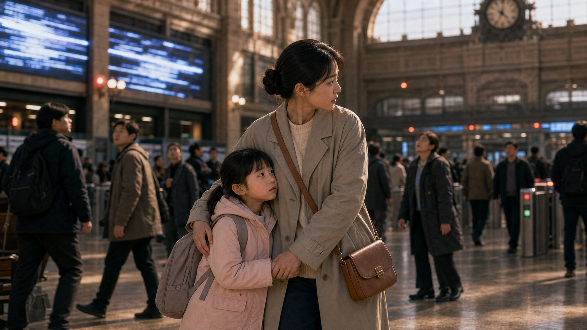

图片路径：

```text
F:\CodexSharedCockpit\episodes\season_01\episode_01\keyframes\op06_op12_director_v1\OP07-5_妈妈握紧并拉近小夏_关键帧_v1.png
```

图生视频 Prompt：

```text
高精度写实 CG 渲染风，电影级悬疑情绪短剧镜头。事故当天午后静海旧北站，暖光候车大厅逐渐被冷白系统警报切开，玻璃顶棚、高窗、闸机、长椅、电子屏、中央时钟、正常人群逐步转为混乱。镜头运动克制，像真实电影摄影机，不做夸张变焦、漂浮运镜或游戏过场。人物动作以眼神、手部、停顿、保护动作和短促移动为主。保持小夏 6-7 岁东亚小女孩、黑色低位小马尾、淡粉儿童连帽外套、小书包；妈妈 30 岁左右东亚女性、黑色低发髻、浅卡其灰外套、斜挎包、温柔但清醒。OP09 起小夏右脚鞋脱落，只穿白袜，左脚仍穿淡粉米白儿童鞋。OP10-OP12 隔离门必须是两米以上高长连续玻璃与金属分区墙，从地面升起，横向贯穿大厅，不是短栏杆或闸机。

本段分镜：OP07-5，系统正式警报。以关键帧构图、人物站位、服装、光线和背景结构为准。画面内容：妈妈握紧小夏手，把她拉近身体内侧，眼神转为警觉。 镜头运动：手部和上半身动作要清楚，妈妈绝不能松手。 动作只围绕这一件事展开，不要自行换场景、换角度、增加新人物或跳到后续剧情。保持情绪克制、真实、可剪辑，最后 0.5 秒稳定在本分镜情绪落点，方便剪辑衔接。
```

负面约束：

```text
不要字幕，不要可读文字，不要水印，不要 logo，不要血腥，不要肢体伤害特写，不要夸张火球，不要恐怖鬼脸，不要二次元萌系，不要动画剧集风，不要真实偷拍感，不要换脸，不要换服装，不要多余手指，不要畸形手，不要把小夏年龄画大，不要把妈妈画成冷漠逃跑。OP09 之后不要让小夏右脚重新穿鞋。OP10-OP12 不要短栏杆、闸机、小门、可绕过隔断。妈妈松手只能是保护性松手，绝不能表现成放弃、推开、转身离开或冷漠逃走。
```

### OP07-6｜妈妈看向轨道连廊方向，护着小夏，低频不安压过环境声。

关键帧图片：

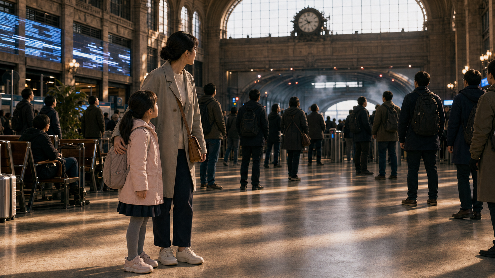

图片路径：

```text
F:\CodexSharedCockpit\episodes\season_01\episode_01\keyframes\op06_op12_director_v1\OP07-6_妈妈警觉看向连廊方向_关键帧_v1.png
```

图生视频 Prompt：

```text
高精度写实 CG 渲染风，电影级悬疑情绪短剧镜头。事故当天午后静海旧北站，暖光候车大厅逐渐被冷白系统警报切开，玻璃顶棚、高窗、闸机、长椅、电子屏、中央时钟、正常人群逐步转为混乱。镜头运动克制，像真实电影摄影机，不做夸张变焦、漂浮运镜或游戏过场。人物动作以眼神、手部、停顿、保护动作和短促移动为主。保持小夏 6-7 岁东亚小女孩、黑色低位小马尾、淡粉儿童连帽外套、小书包；妈妈 30 岁左右东亚女性、黑色低发髻、浅卡其灰外套、斜挎包、温柔但清醒。OP09 起小夏右脚鞋脱落，只穿白袜，左脚仍穿淡粉米白儿童鞋。OP10-OP12 隔离门必须是两米以上高长连续玻璃与金属分区墙，从地面升起，横向贯穿大厅，不是短栏杆或闸机。

本段分镜：OP07-6，系统正式警报。以关键帧构图、人物站位、服装、光线和背景结构为准。画面内容：妈妈看向轨道连廊方向，护着小夏，低频不安压过环境声。 镜头运动：中远景微推，声音先行进入 OP08 巨响。 动作只围绕这一件事展开，不要自行换场景、换角度、增加新人物或跳到后续剧情。保持情绪克制、真实、可剪辑，最后 0.5 秒稳定在本分镜情绪落点，方便剪辑衔接。
```

负面约束：

```text
不要字幕，不要可读文字，不要水印，不要 logo，不要血腥，不要肢体伤害特写，不要夸张火球，不要恐怖鬼脸，不要二次元萌系，不要动画剧集风，不要真实偷拍感，不要换脸，不要换服装，不要多余手指，不要畸形手，不要把小夏年龄画大，不要把妈妈画成冷漠逃跑。OP09 之后不要让小夏右脚重新穿鞋。OP10-OP12 不要短栏杆、闸机、小门、可绕过隔断。妈妈松手只能是保护性松手，绝不能表现成放弃、推开、转身离开或冷漠逃走。
```

---

## OP08｜人群反向混乱

### OP08-1｜远处连廊方向传来巨响，灰尘从高处落下，母女仍在候车大厅。

关键帧图片：

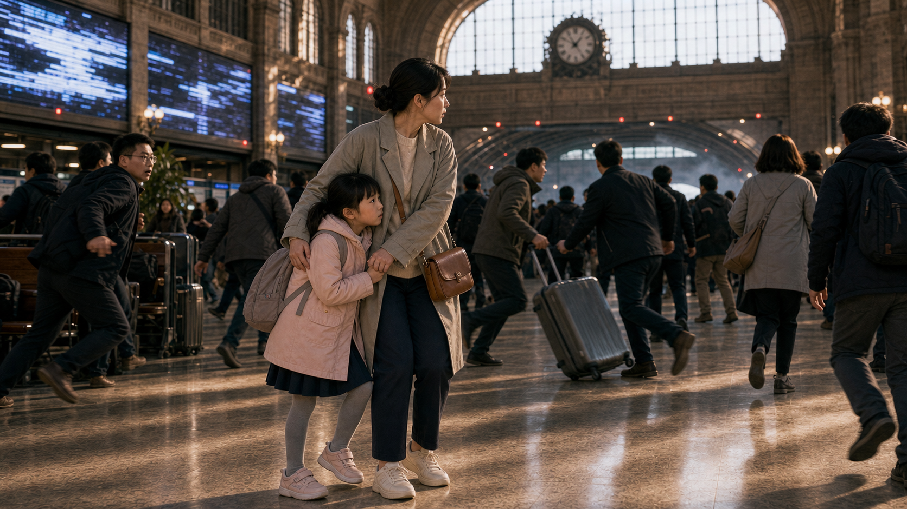

图片路径：

```text
F:\CodexSharedCockpit\episodes\season_01\episode_01\keyframes\op06_op12_director_v1\OP08-1_连廊方向巨响落尘_关键帧_v1.png
```

图生视频 Prompt：

```text
高精度写实 CG 渲染风，电影级悬疑情绪短剧镜头。事故当天午后静海旧北站，暖光候车大厅逐渐被冷白系统警报切开，玻璃顶棚、高窗、闸机、长椅、电子屏、中央时钟、正常人群逐步转为混乱。镜头运动克制，像真实电影摄影机，不做夸张变焦、漂浮运镜或游戏过场。人物动作以眼神、手部、停顿、保护动作和短促移动为主。保持小夏 6-7 岁东亚小女孩、黑色低位小马尾、淡粉儿童连帽外套、小书包；妈妈 30 岁左右东亚女性、黑色低发髻、浅卡其灰外套、斜挎包、温柔但清醒。OP09 起小夏右脚鞋脱落，只穿白袜，左脚仍穿淡粉米白儿童鞋。OP10-OP12 隔离门必须是两米以上高长连续玻璃与金属分区墙，从地面升起，横向贯穿大厅，不是短栏杆或闸机。

本段分镜：OP08-1，人群反向混乱。以关键帧构图、人物站位、服装、光线和背景结构为准。画面内容：远处连廊方向传来巨响，灰尘从高处落下，母女仍在候车大厅。 镜头运动：画面可以轻震但不要乱摇，不要火球和血腥。 动作只围绕这一件事展开，不要自行换场景、换角度、增加新人物或跳到后续剧情。保持情绪克制、真实、可剪辑，最后 0.5 秒稳定在本分镜情绪落点，方便剪辑衔接。
```

负面约束：

```text
不要字幕，不要可读文字，不要水印，不要 logo，不要血腥，不要肢体伤害特写，不要夸张火球，不要恐怖鬼脸，不要二次元萌系，不要动画剧集风，不要真实偷拍感，不要换脸，不要换服装，不要多余手指，不要畸形手，不要把小夏年龄画大，不要把妈妈画成冷漠逃跑。OP09 之后不要让小夏右脚重新穿鞋。OP10-OP12 不要短栏杆、闸机、小门、可绕过隔断。妈妈松手只能是保护性松手，绝不能表现成放弃、推开、转身离开或冷漠逃走。
```

### OP08-2｜人群开始反向涌回，有行李被撞倒，有人逆向奔跑。

关键帧图片：

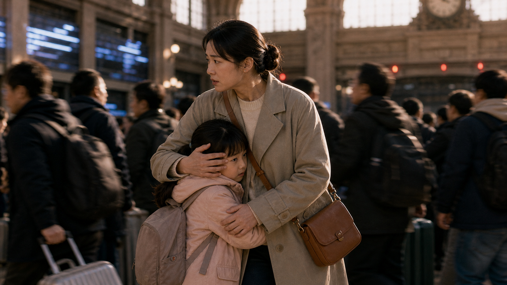

图片路径：

```text
F:\CodexSharedCockpit\episodes\season_01\episode_01\keyframes\op06_op12_director_v1\OP08-2_人群开始反向涌回_关键帧_v1.png
```

图生视频 Prompt：

```text
高精度写实 CG 渲染风，电影级悬疑情绪短剧镜头。事故当天午后静海旧北站，暖光候车大厅逐渐被冷白系统警报切开，玻璃顶棚、高窗、闸机、长椅、电子屏、中央时钟、正常人群逐步转为混乱。镜头运动克制，像真实电影摄影机，不做夸张变焦、漂浮运镜或游戏过场。人物动作以眼神、手部、停顿、保护动作和短促移动为主。保持小夏 6-7 岁东亚小女孩、黑色低位小马尾、淡粉儿童连帽外套、小书包；妈妈 30 岁左右东亚女性、黑色低发髻、浅卡其灰外套、斜挎包、温柔但清醒。OP09 起小夏右脚鞋脱落，只穿白袜，左脚仍穿淡粉米白儿童鞋。OP10-OP12 隔离门必须是两米以上高长连续玻璃与金属分区墙，从地面升起，横向贯穿大厅，不是短栏杆或闸机。

本段分镜：OP08-2，人群反向混乱。以关键帧构图、人物站位、服装、光线和背景结构为准。画面内容：人群开始反向涌回，有行李被撞倒，有人逆向奔跑。 镜头运动：背景从正常转混乱，母女仍是情绪中心。 动作只围绕这一件事展开，不要自行换场景、换角度、增加新人物或跳到后续剧情。保持情绪克制、真实、可剪辑，最后 0.5 秒稳定在本分镜情绪落点，方便剪辑衔接。
```

负面约束：

```text
不要字幕，不要可读文字，不要水印，不要 logo，不要血腥，不要肢体伤害特写，不要夸张火球，不要恐怖鬼脸，不要二次元萌系，不要动画剧集风，不要真实偷拍感，不要换脸，不要换服装，不要多余手指，不要畸形手，不要把小夏年龄画大，不要把妈妈画成冷漠逃跑。OP09 之后不要让小夏右脚重新穿鞋。OP10-OP12 不要短栏杆、闸机、小门、可绕过隔断。妈妈松手只能是保护性松手，绝不能表现成放弃、推开、转身离开或冷漠逃走。
```

### OP08-3｜妈妈把小夏护到身体内侧，一只手紧抓小夏。

关键帧图片：

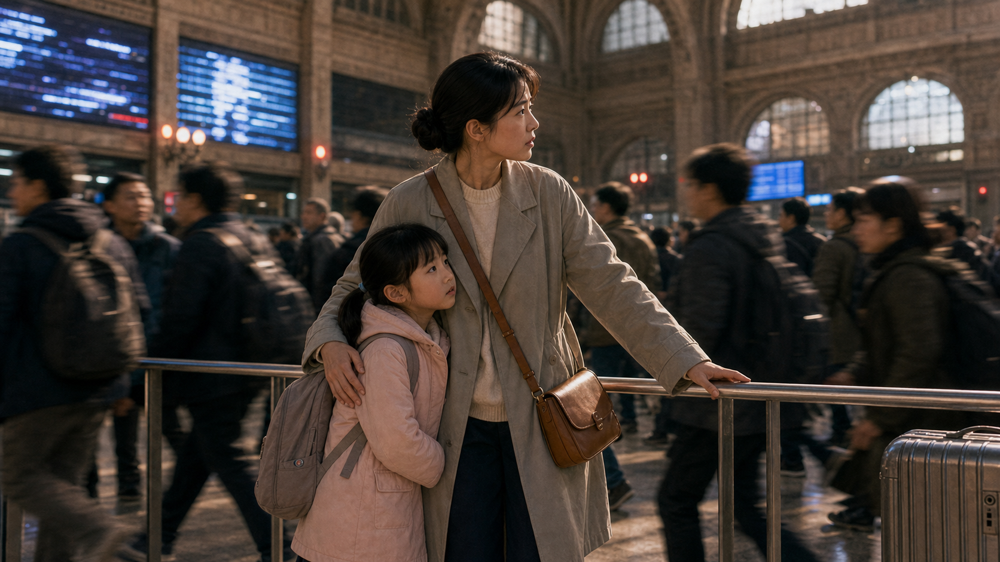

图片路径：

```text
F:\CodexSharedCockpit\episodes\season_01\episode_01\keyframes\op06_op12_director_v1\OP08-3_妈妈把小夏护到内侧_关键帧_v1.png
```

图生视频 Prompt：

```text
高精度写实 CG 渲染风，电影级悬疑情绪短剧镜头。事故当天午后静海旧北站，暖光候车大厅逐渐被冷白系统警报切开，玻璃顶棚、高窗、闸机、长椅、电子屏、中央时钟、正常人群逐步转为混乱。镜头运动克制，像真实电影摄影机，不做夸张变焦、漂浮运镜或游戏过场。人物动作以眼神、手部、停顿、保护动作和短促移动为主。保持小夏 6-7 岁东亚小女孩、黑色低位小马尾、淡粉儿童连帽外套、小书包；妈妈 30 岁左右东亚女性、黑色低发髻、浅卡其灰外套、斜挎包、温柔但清醒。OP09 起小夏右脚鞋脱落，只穿白袜，左脚仍穿淡粉米白儿童鞋。OP10-OP12 隔离门必须是两米以上高长连续玻璃与金属分区墙，从地面升起，横向贯穿大厅，不是短栏杆或闸机。

本段分镜：OP08-3，人群反向混乱。以关键帧构图、人物站位、服装、光线和背景结构为准。画面内容：妈妈把小夏护到身体内侧，一只手紧抓小夏。 镜头运动：核心保护动作必须清楚，妈妈身体挡在人潮和小夏之间。 动作只围绕这一件事展开，不要自行换场景、换角度、增加新人物或跳到后续剧情。保持情绪克制、真实、可剪辑，最后 0.5 秒稳定在本分镜情绪落点，方便剪辑衔接。
```

负面约束：

```text
不要字幕，不要可读文字，不要水印，不要 logo，不要血腥，不要肢体伤害特写，不要夸张火球，不要恐怖鬼脸，不要二次元萌系，不要动画剧集风，不要真实偷拍感，不要换脸，不要换服装，不要多余手指，不要畸形手，不要把小夏年龄画大，不要把妈妈画成冷漠逃跑。OP09 之后不要让小夏右脚重新穿鞋。OP10-OP12 不要短栏杆、闸机、小门、可绕过隔断。妈妈松手只能是保护性松手，绝不能表现成放弃、推开、转身离开或冷漠逃走。
```

### OP08-4｜妈妈一手抓小夏，一手撑栏杆或挡住冲来的人流。

关键帧图片：

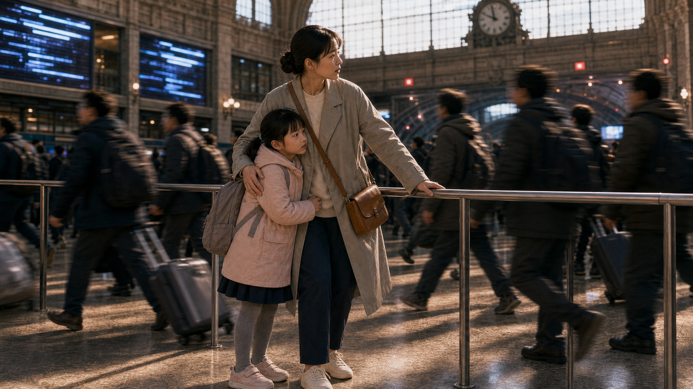

图片路径：

```text
F:\CodexSharedCockpit\episodes\season_01\episode_01\keyframes\op06_op12_director_v1\OP08-4_妈妈撑栏杆护住小夏_关键帧_v1.png
```

图生视频 Prompt：

```text
高精度写实 CG 渲染风，电影级悬疑情绪短剧镜头。事故当天午后静海旧北站，暖光候车大厅逐渐被冷白系统警报切开，玻璃顶棚、高窗、闸机、长椅、电子屏、中央时钟、正常人群逐步转为混乱。镜头运动克制，像真实电影摄影机，不做夸张变焦、漂浮运镜或游戏过场。人物动作以眼神、手部、停顿、保护动作和短促移动为主。保持小夏 6-7 岁东亚小女孩、黑色低位小马尾、淡粉儿童连帽外套、小书包；妈妈 30 岁左右东亚女性、黑色低发髻、浅卡其灰外套、斜挎包、温柔但清醒。OP09 起小夏右脚鞋脱落，只穿白袜，左脚仍穿淡粉米白儿童鞋。OP10-OP12 隔离门必须是两米以上高长连续玻璃与金属分区墙，从地面升起，横向贯穿大厅，不是短栏杆或闸机。

本段分镜：OP08-4，人群反向混乱。以关键帧构图、人物站位、服装、光线和背景结构为准。画面内容：妈妈一手抓小夏，一手撑栏杆或挡住冲来的人流。 镜头运动：妈妈保护姿态稳定，不是被动拖拽。 动作只围绕这一件事展开，不要自行换场景、换角度、增加新人物或跳到后续剧情。保持情绪克制、真实、可剪辑，最后 0.5 秒稳定在本分镜情绪落点，方便剪辑衔接。
```

负面约束：

```text
不要字幕，不要可读文字，不要水印，不要 logo，不要血腥，不要肢体伤害特写，不要夸张火球，不要恐怖鬼脸，不要二次元萌系，不要动画剧集风，不要真实偷拍感，不要换脸，不要换服装，不要多余手指，不要畸形手，不要把小夏年龄画大，不要把妈妈画成冷漠逃跑。OP09 之后不要让小夏右脚重新穿鞋。OP10-OP12 不要短栏杆、闸机、小门、可绕过隔断。妈妈松手只能是保护性松手，绝不能表现成放弃、推开、转身离开或冷漠逃走。
```

### OP08-5｜小夏紧贴妈妈，眼睛被吓大，背景人流压迫。

关键帧图片：

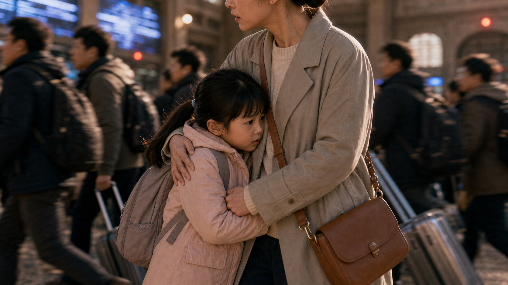

图片路径：

```text
F:\CodexSharedCockpit\episodes\season_01\episode_01\keyframes\op06_op12_director_v1\OP08-5_小夏紧贴妈妈_关键帧_v1.png
```

图生视频 Prompt：

```text
高精度写实 CG 渲染风，电影级悬疑情绪短剧镜头。事故当天午后静海旧北站，暖光候车大厅逐渐被冷白系统警报切开，玻璃顶棚、高窗、闸机、长椅、电子屏、中央时钟、正常人群逐步转为混乱。镜头运动克制，像真实电影摄影机，不做夸张变焦、漂浮运镜或游戏过场。人物动作以眼神、手部、停顿、保护动作和短促移动为主。保持小夏 6-7 岁东亚小女孩、黑色低位小马尾、淡粉儿童连帽外套、小书包；妈妈 30 岁左右东亚女性、黑色低发髻、浅卡其灰外套、斜挎包、温柔但清醒。OP09 起小夏右脚鞋脱落，只穿白袜，左脚仍穿淡粉米白儿童鞋。OP10-OP12 隔离门必须是两米以上高长连续玻璃与金属分区墙，从地面升起，横向贯穿大厅，不是短栏杆或闸机。

本段分镜：OP08-5，人群反向混乱。以关键帧构图、人物站位、服装、光线和背景结构为准。画面内容：小夏紧贴妈妈，眼睛被吓大，背景人流压迫。 镜头运动：小夏两只鞋仍在，情绪是害怕但仍相信妈妈。 动作只围绕这一件事展开，不要自行换场景、换角度、增加新人物或跳到后续剧情。保持情绪克制、真实、可剪辑，最后 0.5 秒稳定在本分镜情绪落点，方便剪辑衔接。
```

负面约束：

```text
不要字幕，不要可读文字，不要水印，不要 logo，不要血腥，不要肢体伤害特写，不要夸张火球，不要恐怖鬼脸，不要二次元萌系，不要动画剧集风，不要真实偷拍感，不要换脸，不要换服装，不要多余手指，不要畸形手，不要把小夏年龄画大，不要把妈妈画成冷漠逃跑。OP09 之后不要让小夏右脚重新穿鞋。OP10-OP12 不要短栏杆、闸机、小门、可绕过隔断。妈妈松手只能是保护性松手，绝不能表现成放弃、推开、转身离开或冷漠逃走。
```

### OP08-6｜人流继续挤压，地面分区线和隔离系统轨道开始进入画面。

关键帧图片：

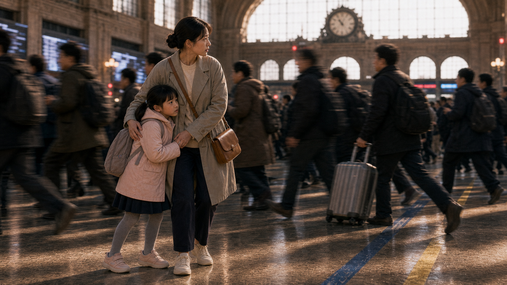

图片路径：

```text
F:\CodexSharedCockpit\episodes\season_01\episode_01\keyframes\op06_op12_director_v1\OP08-6_人流持续挤压进入分区线_关键帧_v1.png
```

图生视频 Prompt：

```text
高精度写实 CG 渲染风，电影级悬疑情绪短剧镜头。事故当天午后静海旧北站，暖光候车大厅逐渐被冷白系统警报切开，玻璃顶棚、高窗、闸机、长椅、电子屏、中央时钟、正常人群逐步转为混乱。镜头运动克制，像真实电影摄影机，不做夸张变焦、漂浮运镜或游戏过场。人物动作以眼神、手部、停顿、保护动作和短促移动为主。保持小夏 6-7 岁东亚小女孩、黑色低位小马尾、淡粉儿童连帽外套、小书包；妈妈 30 岁左右东亚女性、黑色低发髻、浅卡其灰外套、斜挎包、温柔但清醒。OP09 起小夏右脚鞋脱落，只穿白袜，左脚仍穿淡粉米白儿童鞋。OP10-OP12 隔离门必须是两米以上高长连续玻璃与金属分区墙，从地面升起，横向贯穿大厅，不是短栏杆或闸机。

本段分镜：OP08-6，人群反向混乱。以关键帧构图、人物站位、服装、光线和背景结构为准。画面内容：人流继续挤压，地面分区线和隔离系统轨道开始进入画面。 镜头运动：为 OP09 掉鞋和 OP10 隔离门埋空间伏笔。 动作只围绕这一件事展开，不要自行换场景、换角度、增加新人物或跳到后续剧情。保持情绪克制、真实、可剪辑，最后 0.5 秒稳定在本分镜情绪落点，方便剪辑衔接。
```

负面约束：

```text
不要字幕，不要可读文字，不要水印，不要 logo，不要血腥，不要肢体伤害特写，不要夸张火球，不要恐怖鬼脸，不要二次元萌系，不要动画剧集风，不要真实偷拍感，不要换脸，不要换服装，不要多余手指，不要畸形手，不要把小夏年龄画大，不要把妈妈画成冷漠逃跑。OP09 之后不要让小夏右脚重新穿鞋。OP10-OP12 不要短栏杆、闸机、小门、可绕过隔断。妈妈松手只能是保护性松手，绝不能表现成放弃、推开、转身离开或冷漠逃走。
```

---

## OP09｜右脚鞋掉落

### OP09-1｜低机位看混乱脚步、弃箱、闸机边缘和地面警示光，压迫感强。

关键帧图片：


图片路径：

```text
F:\CodexSharedCockpit\episodes\season_01\episode_01\keyframes\op06_op12_director_v1\OP09-1_低机位脚步行李压迫_关键帧_v1.png
```

图生视频 Prompt：

```text
高精度写实 CG 渲染风，电影级悬疑情绪短剧镜头。事故当天午后静海旧北站，暖光候车大厅逐渐被冷白系统警报切开，玻璃顶棚、高窗、闸机、长椅、电子屏、中央时钟、正常人群逐步转为混乱。镜头运动克制，像真实电影摄影机，不做夸张变焦、漂浮运镜或游戏过场。人物动作以眼神、手部、停顿、保护动作和短促移动为主。保持小夏 6-7 岁东亚小女孩、黑色低位小马尾、淡粉儿童连帽外套、小书包；妈妈 30 岁左右东亚女性、黑色低发髻、浅卡其灰外套、斜挎包、温柔但清醒。OP09 起小夏右脚鞋脱落，只穿白袜，左脚仍穿淡粉米白儿童鞋。OP10-OP12 隔离门必须是两米以上高长连续玻璃与金属分区墙，从地面升起，横向贯穿大厅，不是短栏杆或闸机。

本段分镜：OP09-1，右脚鞋掉落。以关键帧构图、人物站位、服装、光线和背景结构为准。画面内容：低机位看混乱脚步、弃箱、闸机边缘和地面警示光，压迫感强。 镜头运动：脚步从画面边缘掠过，压迫先于掉鞋。 动作只围绕这一件事展开，不要自行换场景、换角度、增加新人物或跳到后续剧情。保持情绪克制、真实、可剪辑，最后 0.5 秒稳定在本分镜情绪落点，方便剪辑衔接。
```

负面约束：

```text
不要字幕，不要可读文字，不要水印，不要 logo，不要血腥，不要肢体伤害特写，不要夸张火球，不要恐怖鬼脸，不要二次元萌系，不要动画剧集风，不要真实偷拍感，不要换脸，不要换服装，不要多余手指，不要畸形手，不要把小夏年龄画大，不要把妈妈画成冷漠逃跑。OP09 之后不要让小夏右脚重新穿鞋。OP10-OP12 不要短栏杆、闸机、小门、可绕过隔断。妈妈松手只能是保护性松手，绝不能表现成放弃、推开、转身离开或冷漠逃走。
```

### OP09-2｜小夏右脚淡粉米白儿童鞋被弃箱或闸机边缘卡住，左脚鞋仍正常

关键帧图片：

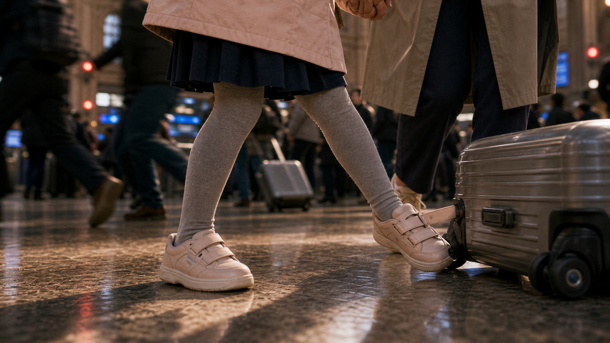

图片路径：

```text
F:\CodexSharedCockpit\episodes\season_01\episode_01\keyframes\op06_op12_director_v1\OP09-2_右脚鞋被行李卡住_关键帧_v1.png
```

图生视频 Prompt：

```text
高精度写实 CG 渲染风，电影级悬疑情绪短剧镜头。事故当天午后静海旧北站，暖光候车大厅逐渐被冷白系统警报切开，玻璃顶棚、高窗、闸机、长椅、电子屏、中央时钟、正常人群逐步转为混乱。镜头运动克制，像真实电影摄影机，不做夸张变焦、漂浮运镜或游戏过场。人物动作以眼神、手部、停顿、保护动作和短促移动为主。保持小夏 6-7 岁东亚小女孩、黑色低位小马尾、淡粉儿童连帽外套、小书包；妈妈 30 岁左右东亚女性、黑色低发髻、浅卡其灰外套、斜挎包、温柔但清醒。OP09 起小夏右脚鞋脱落，只穿白袜，左脚仍穿淡粉米白儿童鞋。OP10-OP12 隔离门必须是两米以上高长连续玻璃与金属分区墙，从地面升起，横向贯穿大厅，不是短栏杆或闸机。

本段分镜：OP09-2，右脚鞋掉落。以关键帧构图、人物站位、服装、光线和背景结构为准。画面内容：小夏右脚淡粉米白儿童鞋被弃箱或闸机边缘卡住，左脚鞋仍正常。 镜头运动：明确是右脚鞋被卡，镜头要看清鞋和白袜还没有完全脱离。 动作只围绕这一件事展开，不要自行换场景、换角度、增加新人物或跳到后续剧情。保持情绪克制、真实、可剪辑，最后 0.5 秒稳定在本分镜情绪落点，方便剪辑衔接。
```

负面约束：

```text
不要字幕，不要可读文字，不要水印，不要 logo，不要血腥，不要肢体伤害特写，不要夸张火球，不要恐怖鬼脸，不要二次元萌系，不要动画剧集风，不要真实偷拍感，不要换脸，不要换服装，不要多余手指，不要畸形手，不要把小夏年龄画大，不要把妈妈画成冷漠逃跑。OP09 之后不要让小夏右脚重新穿鞋。OP10-OP12 不要短栏杆、闸机、小门、可绕过隔断。妈妈松手只能是保护性松手，绝不能表现成放弃、推开、转身离开或冷漠逃走。
```

### OP09-3｜右脚鞋从小夏脚上滑脱，右脚露出白袜，左脚仍穿单鞋。

关键帧图片：

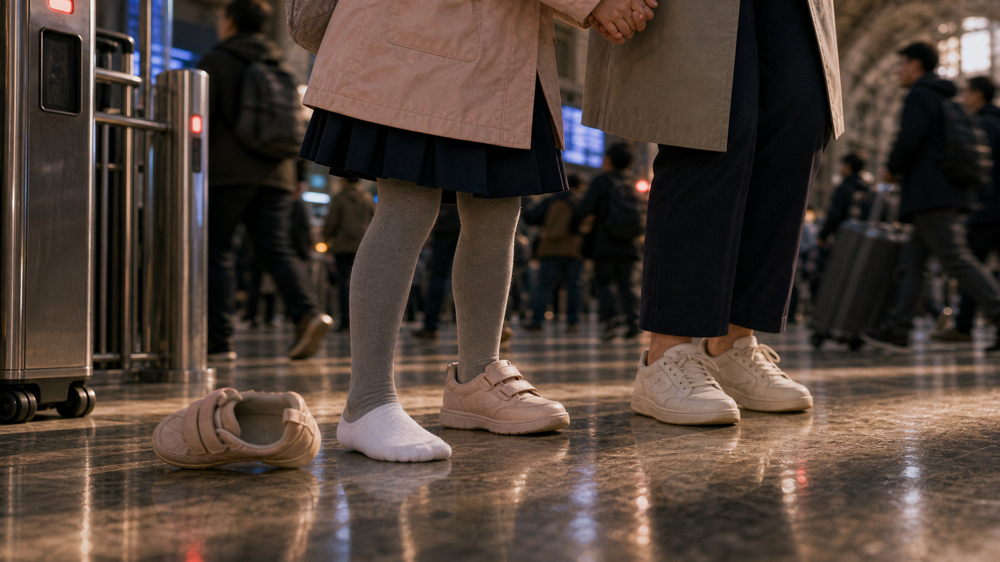

图片路径：

```text
F:\CodexSharedCockpit\episodes\season_01\episode_01\keyframes\op06_op12_director_v1\OP09-3_右脚鞋脱落露出白袜_关键帧_v1.png
```

图生视频 Prompt：

```text
高精度写实 CG 渲染风，电影级悬疑情绪短剧镜头。事故当天午后静海旧北站，暖光候车大厅逐渐被冷白系统警报切开，玻璃顶棚、高窗、闸机、长椅、电子屏、中央时钟、正常人群逐步转为混乱。镜头运动克制，像真实电影摄影机，不做夸张变焦、漂浮运镜或游戏过场。人物动作以眼神、手部、停顿、保护动作和短促移动为主。保持小夏 6-7 岁东亚小女孩、黑色低位小马尾、淡粉儿童连帽外套、小书包；妈妈 30 岁左右东亚女性、黑色低发髻、浅卡其灰外套、斜挎包、温柔但清醒。OP09 起小夏右脚鞋脱落，只穿白袜，左脚仍穿淡粉米白儿童鞋。OP10-OP12 隔离门必须是两米以上高长连续玻璃与金属分区墙，从地面升起，横向贯穿大厅，不是短栏杆或闸机。

本段分镜：OP09-3，右脚鞋掉落。以关键帧构图、人物站位、服装、光线和背景结构为准。画面内容：右脚鞋从小夏脚上滑脱，右脚露出白袜，左脚仍穿单鞋。 镜头运动：掉落瞬间要清楚，不能掉反，不能两脚都穿鞋。 动作只围绕这一件事展开，不要自行换场景、换角度、增加新人物或跳到后续剧情。保持情绪克制、真实、可剪辑，最后 0.5 秒稳定在本分镜情绪落点，方便剪辑衔接。
```

负面约束：

```text
不要字幕，不要可读文字，不要水印，不要 logo，不要血腥，不要肢体伤害特写，不要夸张火球，不要恐怖鬼脸，不要二次元萌系，不要动画剧集风，不要真实偷拍感，不要换脸，不要换服装，不要多余手指，不要畸形手，不要把小夏年龄画大，不要把妈妈画成冷漠逃跑。OP09 之后不要让小夏右脚重新穿鞋。OP10-OP12 不要短栏杆、闸机、小门、可绕过隔断。妈妈松手只能是保护性松手，绝不能表现成放弃、推开、转身离开或冷漠逃走。
```

### OP09-4｜小夏下意识低头想回去捡鞋。

关键帧图片：

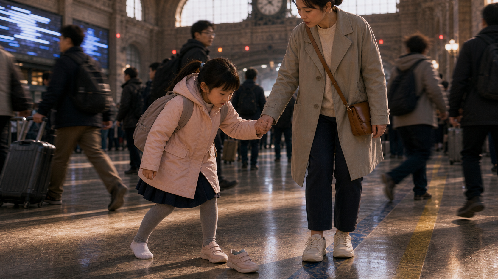

图片路径：

```text
F:\CodexSharedCockpit\episodes\season_01\episode_01\keyframes\op06_op12_director_v1\OP09-4_小夏低头想捡鞋_关键帧_v1.png
```

图生视频 Prompt：

```text
高精度写实 CG 渲染风，电影级悬疑情绪短剧镜头。事故当天午后静海旧北站，暖光候车大厅逐渐被冷白系统警报切开，玻璃顶棚、高窗、闸机、长椅、电子屏、中央时钟、正常人群逐步转为混乱。镜头运动克制，像真实电影摄影机，不做夸张变焦、漂浮运镜或游戏过场。人物动作以眼神、手部、停顿、保护动作和短促移动为主。保持小夏 6-7 岁东亚小女孩、黑色低位小马尾、淡粉儿童连帽外套、小书包；妈妈 30 岁左右东亚女性、黑色低发髻、浅卡其灰外套、斜挎包、温柔但清醒。OP09 起小夏右脚鞋脱落，只穿白袜，左脚仍穿淡粉米白儿童鞋。OP10-OP12 隔离门必须是两米以上高长连续玻璃与金属分区墙，从地面升起，横向贯穿大厅，不是短栏杆或闸机。

本段分镜：OP09-4，右脚鞋掉落。以关键帧构图、人物站位、服装、光线和背景结构为准。画面内容：小夏下意识低头想回去捡鞋。 镜头运动：中景偏小夏，动作只到想回头，不能真的捡到。 动作只围绕这一件事展开，不要自行换场景、换角度、增加新人物或跳到后续剧情。保持情绪克制、真实、可剪辑，最后 0.5 秒稳定在本分镜情绪落点，方便剪辑衔接。
```

负面约束：

```text
不要字幕，不要可读文字，不要水印，不要 logo，不要血腥，不要肢体伤害特写，不要夸张火球，不要恐怖鬼脸，不要二次元萌系，不要动画剧集风，不要真实偷拍感，不要换脸，不要换服装，不要多余手指，不要畸形手，不要把小夏年龄画大，不要把妈妈画成冷漠逃跑。OP09 之后不要让小夏右脚重新穿鞋。OP10-OP12 不要短栏杆、闸机、小门、可绕过隔断。妈妈松手只能是保护性松手，绝不能表现成放弃、推开、转身离开或冷漠逃走。
```

### OP09-5｜妈妈立刻拉住小夏，阻止她回头捡鞋。

关键帧图片：

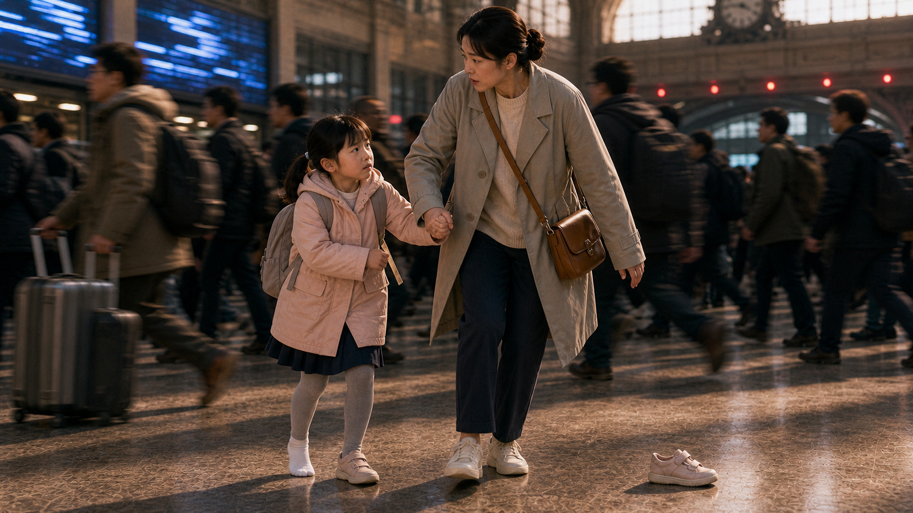

图片路径：

```text
F:\CodexSharedCockpit\episodes\season_01\episode_01\keyframes\op06_op12_director_v1\OP09-5_妈妈阻止小夏捡鞋_关键帧_v1.png
```

图生视频 Prompt：

```text
高精度写实 CG 渲染风，电影级悬疑情绪短剧镜头。事故当天午后静海旧北站，暖光候车大厅逐渐被冷白系统警报切开，玻璃顶棚、高窗、闸机、长椅、电子屏、中央时钟、正常人群逐步转为混乱。镜头运动克制，像真实电影摄影机，不做夸张变焦、漂浮运镜或游戏过场。人物动作以眼神、手部、停顿、保护动作和短促移动为主。保持小夏 6-7 岁东亚小女孩、黑色低位小马尾、淡粉儿童连帽外套、小书包；妈妈 30 岁左右东亚女性、黑色低发髻、浅卡其灰外套、斜挎包、温柔但清醒。OP09 起小夏右脚鞋脱落，只穿白袜，左脚仍穿淡粉米白儿童鞋。OP10-OP12 隔离门必须是两米以上高长连续玻璃与金属分区墙，从地面升起，横向贯穿大厅，不是短栏杆或闸机。

本段分镜：OP09-5，右脚鞋掉落。以关键帧构图、人物站位、服装、光线和背景结构为准。画面内容：妈妈立刻拉住小夏，阻止她回头捡鞋。 镜头运动：妈妈仍牵着她，保护性强于责备感。 动作只围绕这一件事展开，不要自行换场景、换角度、增加新人物或跳到后续剧情。保持情绪克制、真实、可剪辑，最后 0.5 秒稳定在本分镜情绪落点，方便剪辑衔接。
```

负面约束：

```text
不要字幕，不要可读文字，不要水印，不要 logo，不要血腥，不要肢体伤害特写，不要夸张火球，不要恐怖鬼脸，不要二次元萌系，不要动画剧集风，不要真实偷拍感，不要换脸，不要换服装，不要多余手指，不要畸形手，不要把小夏年龄画大，不要把妈妈画成冷漠逃跑。OP09 之后不要让小夏右脚重新穿鞋。OP10-OP12 不要短栏杆、闸机、小门、可绕过隔断。妈妈松手只能是保护性松手，绝不能表现成放弃、推开、转身离开或冷漠逃走。
```

### OP09-6｜小夏被吓到抬头看妈妈，右脚白袜、左脚单鞋清楚。

关键帧图片：

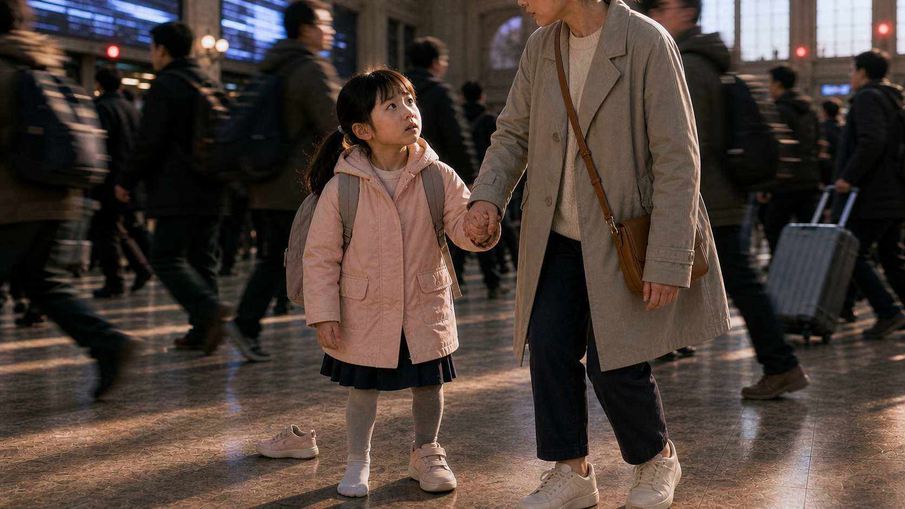

图片路径：

```text
F:\CodexSharedCockpit\episodes\season_01\episode_01\keyframes\op06_op12_director_v1\OP09-6_小夏吓到抬头看妈妈_关键帧_v1.png
```

图生视频 Prompt：

```text
高精度写实 CG 渲染风，电影级悬疑情绪短剧镜头。事故当天午后静海旧北站，暖光候车大厅逐渐被冷白系统警报切开，玻璃顶棚、高窗、闸机、长椅、电子屏、中央时钟、正常人群逐步转为混乱。镜头运动克制，像真实电影摄影机，不做夸张变焦、漂浮运镜或游戏过场。人物动作以眼神、手部、停顿、保护动作和短促移动为主。保持小夏 6-7 岁东亚小女孩、黑色低位小马尾、淡粉儿童连帽外套、小书包；妈妈 30 岁左右东亚女性、黑色低发髻、浅卡其灰外套、斜挎包、温柔但清醒。OP09 起小夏右脚鞋脱落，只穿白袜，左脚仍穿淡粉米白儿童鞋。OP10-OP12 隔离门必须是两米以上高长连续玻璃与金属分区墙，从地面升起，横向贯穿大厅，不是短栏杆或闸机。

本段分镜：OP09-6，右脚鞋掉落。以关键帧构图、人物站位、服装、光线和背景结构为准。画面内容：小夏被吓到抬头看妈妈，右脚白袜、左脚单鞋清楚。 镜头运动：短暂停顿，观众看懂她已经少了一只鞋。 动作只围绕这一件事展开，不要自行换场景、换角度、增加新人物或跳到后续剧情。保持情绪克制、真实、可剪辑，最后 0.5 秒稳定在本分镜情绪落点，方便剪辑衔接。
```

负面约束：

```text
不要字幕，不要可读文字，不要水印，不要 logo，不要血腥，不要肢体伤害特写，不要夸张火球，不要恐怖鬼脸，不要二次元萌系，不要动画剧集风，不要真实偷拍感，不要换脸，不要换服装，不要多余手指，不要畸形手，不要把小夏年龄画大，不要把妈妈画成冷漠逃跑。OP09 之后不要让小夏右脚重新穿鞋。OP10-OP12 不要短栏杆、闸机、小门、可绕过隔断。妈妈松手只能是保护性松手，绝不能表现成放弃、推开、转身离开或冷漠逃走。
```

### OP09-7｜妈妈把小夏往身边带，背景人流继续推向隔离分区线。

关键帧图片：

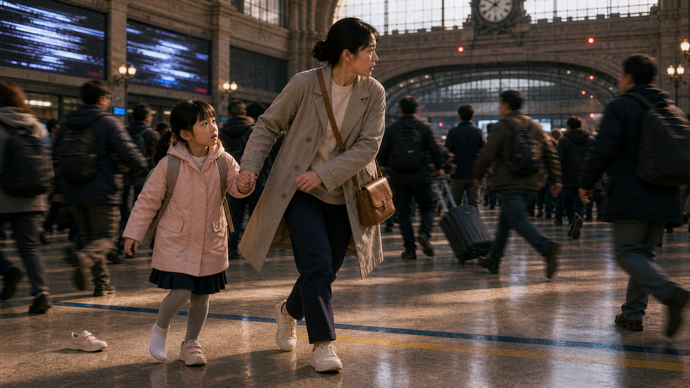

图片路径：

```text
F:\CodexSharedCockpit\episodes\season_01\episode_01\keyframes\op06_op12_director_v1\OP09-7_妈妈拉回小夏继续前行_关键帧_v1.png
```

图生视频 Prompt：

```text
高精度写实 CG 渲染风，电影级悬疑情绪短剧镜头。事故当天午后静海旧北站，暖光候车大厅逐渐被冷白系统警报切开，玻璃顶棚、高窗、闸机、长椅、电子屏、中央时钟、正常人群逐步转为混乱。镜头运动克制，像真实电影摄影机，不做夸张变焦、漂浮运镜或游戏过场。人物动作以眼神、手部、停顿、保护动作和短促移动为主。保持小夏 6-7 岁东亚小女孩、黑色低位小马尾、淡粉儿童连帽外套、小书包；妈妈 30 岁左右东亚女性、黑色低发髻、浅卡其灰外套、斜挎包、温柔但清醒。OP09 起小夏右脚鞋脱落，只穿白袜，左脚仍穿淡粉米白儿童鞋。OP10-OP12 隔离门必须是两米以上高长连续玻璃与金属分区墙，从地面升起，横向贯穿大厅，不是短栏杆或闸机。

本段分镜：OP09-7，右脚鞋掉落。以关键帧构图、人物站位、服装、光线和背景结构为准。画面内容：妈妈把小夏往身边带，背景人流继续推向隔离分区线。 镜头运动：承接 OP10，鞋留在原地，母女仍牵手。 动作只围绕这一件事展开，不要自行换场景、换角度、增加新人物或跳到后续剧情。保持情绪克制、真实、可剪辑，最后 0.5 秒稳定在本分镜情绪落点，方便剪辑衔接。
```

负面约束：

```text
不要字幕，不要可读文字，不要水印，不要 logo，不要血腥，不要肢体伤害特写，不要夸张火球，不要恐怖鬼脸，不要二次元萌系，不要动画剧集风，不要真实偷拍感，不要换脸，不要换服装，不要多余手指，不要畸形手，不要把小夏年龄画大，不要把妈妈画成冷漠逃跑。OP09 之后不要让小夏右脚重新穿鞋。OP10-OP12 不要短栏杆、闸机、小门、可绕过隔断。妈妈松手只能是保护性松手，绝不能表现成放弃、推开、转身离开或冷漠逃走。
```

---

## OP10｜保护性松手与隔离门升起

### OP10-1｜低机位脚部与手部关系，小夏右脚白袜踩在冷白警示线旁，左脚

关键帧图片：


图片路径：

```text
F:\CodexSharedCockpit\episodes\season_01\episode_01\keyframes\op06_op12_director_v1\OP10-1_白袜单鞋牵手警示线_关键帧_v1.png
```

图生视频 Prompt：

```text
高精度写实 CG 渲染风，电影级悬疑情绪短剧镜头。事故当天午后静海旧北站，暖光候车大厅逐渐被冷白系统警报切开，玻璃顶棚、高窗、闸机、长椅、电子屏、中央时钟、正常人群逐步转为混乱。镜头运动克制，像真实电影摄影机，不做夸张变焦、漂浮运镜或游戏过场。人物动作以眼神、手部、停顿、保护动作和短促移动为主。保持小夏 6-7 岁东亚小女孩、黑色低位小马尾、淡粉儿童连帽外套、小书包；妈妈 30 岁左右东亚女性、黑色低发髻、浅卡其灰外套、斜挎包、温柔但清醒。OP09 起小夏右脚鞋脱落，只穿白袜，左脚仍穿淡粉米白儿童鞋。OP10-OP12 隔离门必须是两米以上高长连续玻璃与金属分区墙，从地面升起，横向贯穿大厅，不是短栏杆或闸机。

本段分镜：OP10-1，保护性松手与隔离门升起。以关键帧构图、人物站位、服装、光线和背景结构为准。画面内容：低机位脚部与手部关系，小夏右脚白袜踩在冷白警示线旁，左脚单鞋，妈妈仍紧紧牵着小夏。 镜头运动：先锁住仍牵手和右脚白袜，背景人腿掠过。 动作只围绕这一件事展开，不要自行换场景、换角度、增加新人物或跳到后续剧情。保持情绪克制、真实、可剪辑，最后 0.5 秒稳定在本分镜情绪落点，方便剪辑衔接。
```

负面约束：

```text
不要字幕，不要可读文字，不要水印，不要 logo，不要血腥，不要肢体伤害特写，不要夸张火球，不要恐怖鬼脸，不要二次元萌系，不要动画剧集风，不要真实偷拍感，不要换脸，不要换服装，不要多余手指，不要畸形手，不要把小夏年龄画大，不要把妈妈画成冷漠逃跑。OP09 之后不要让小夏右脚重新穿鞋。OP10-OP12 不要短栏杆、闸机、小门、可绕过隔断。妈妈松手只能是保护性松手，绝不能表现成放弃、推开、转身离开或冷漠逃走。
```

### OP10-2｜地面轨道亮起，细窄金属隔离栏从母女手臂之间顶出。

关键帧图片：

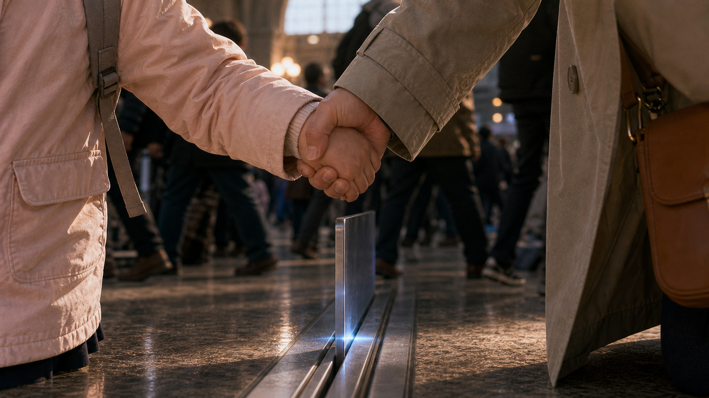

图片路径：

```text
F:\CodexSharedCockpit\episodes\season_01\episode_01\keyframes\op06_op12_director_v1\OP10-2_隔离栏从手臂之间升起_关键帧_v1.png
```

图生视频 Prompt：

```text
高精度写实 CG 渲染风，电影级悬疑情绪短剧镜头。事故当天午后静海旧北站，暖光候车大厅逐渐被冷白系统警报切开，玻璃顶棚、高窗、闸机、长椅、电子屏、中央时钟、正常人群逐步转为混乱。镜头运动克制，像真实电影摄影机，不做夸张变焦、漂浮运镜或游戏过场。人物动作以眼神、手部、停顿、保护动作和短促移动为主。保持小夏 6-7 岁东亚小女孩、黑色低位小马尾、淡粉儿童连帽外套、小书包；妈妈 30 岁左右东亚女性、黑色低发髻、浅卡其灰外套、斜挎包、温柔但清醒。OP09 起小夏右脚鞋脱落，只穿白袜，左脚仍穿淡粉米白儿童鞋。OP10-OP12 隔离门必须是两米以上高长连续玻璃与金属分区墙，从地面升起，横向贯穿大厅，不是短栏杆或闸机。

本段分镜：OP10-2，保护性松手与隔离门升起。以关键帧构图、人物站位、服装、光线和背景结构为准。画面内容：地面轨道亮起，细窄金属隔离栏从母女手臂之间顶出。 镜头运动：手部极近景，让危险贴近小夏手臂。 动作只围绕这一件事展开，不要自行换场景、换角度、增加新人物或跳到后续剧情。保持情绪克制、真实、可剪辑，最后 0.5 秒稳定在本分镜情绪落点，方便剪辑衔接。
```

负面约束：

```text
不要字幕，不要可读文字，不要水印，不要 logo，不要血腥，不要肢体伤害特写，不要夸张火球，不要恐怖鬼脸，不要二次元萌系，不要动画剧集风，不要真实偷拍感，不要换脸，不要换服装，不要多余手指，不要畸形手，不要把小夏年龄画大，不要把妈妈画成冷漠逃跑。OP09 之后不要让小夏右脚重新穿鞋。OP10-OP12 不要短栏杆、闸机、小门、可绕过隔断。妈妈松手只能是保护性松手，绝不能表现成放弃、推开、转身离开或冷漠逃走。
```

### OP10-3｜小夏脸部特写，冷白门体反光映在眼睛里，表情从疑惑转为愣住

关键帧图片：

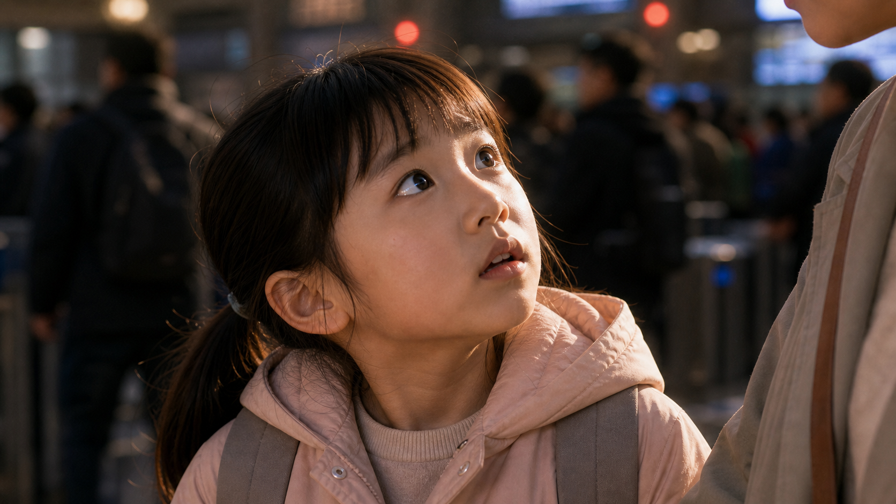

图片路径：

```text
F:\CodexSharedCockpit\episodes\season_01\episode_01\keyframes\op06_op12_director_v1\OP10-3_小夏愣住看妈妈_关键帧_v1.png
```

图生视频 Prompt：

```text
高精度写实 CG 渲染风，电影级悬疑情绪短剧镜头。事故当天午后静海旧北站，暖光候车大厅逐渐被冷白系统警报切开，玻璃顶棚、高窗、闸机、长椅、电子屏、中央时钟、正常人群逐步转为混乱。镜头运动克制，像真实电影摄影机，不做夸张变焦、漂浮运镜或游戏过场。人物动作以眼神、手部、停顿、保护动作和短促移动为主。保持小夏 6-7 岁东亚小女孩、黑色低位小马尾、淡粉儿童连帽外套、小书包；妈妈 30 岁左右东亚女性、黑色低发髻、浅卡其灰外套、斜挎包、温柔但清醒。OP09 起小夏右脚鞋脱落，只穿白袜，左脚仍穿淡粉米白儿童鞋。OP10-OP12 隔离门必须是两米以上高长连续玻璃与金属分区墙，从地面升起，横向贯穿大厅，不是短栏杆或闸机。

本段分镜：OP10-3，保护性松手与隔离门升起。以关键帧构图、人物站位、服装、光线和背景结构为准。画面内容：小夏脸部特写，冷白门体反光映在眼睛里，表情从疑惑转为愣住。 镜头运动：先愣住，不要立刻大哭。 动作只围绕这一件事展开，不要自行换场景、换角度、增加新人物或跳到后续剧情。保持情绪克制、真实、可剪辑，最后 0.5 秒稳定在本分镜情绪落点，方便剪辑衔接。
```

负面约束：

```text
不要字幕，不要可读文字，不要水印，不要 logo，不要血腥，不要肢体伤害特写，不要夸张火球，不要恐怖鬼脸，不要二次元萌系，不要动画剧集风，不要真实偷拍感，不要换脸，不要换服装，不要多余手指，不要畸形手，不要把小夏年龄画大，不要把妈妈画成冷漠逃跑。OP09 之后不要让小夏右脚重新穿鞋。OP10-OP12 不要短栏杆、闸机、小门、可绕过隔断。妈妈松手只能是保护性松手，绝不能表现成放弃、推开、转身离开或冷漠逃走。
```

### OP10-4｜妈妈眼神特写，看见金属边缘逼近小夏手臂，瞳孔收紧。

关键帧图片：

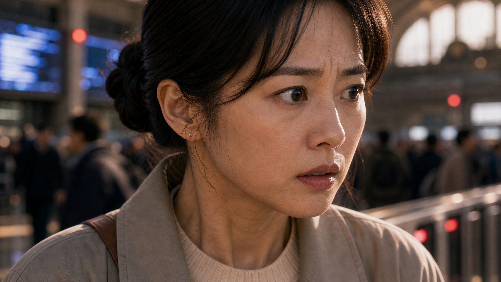

图片路径：

```text
F:\CodexSharedCockpit\episodes\season_01\episode_01\keyframes\op06_op12_director_v1\OP10-4_妈妈眼神判断危险_关键帧_v1.png
```

图生视频 Prompt：

```text
高精度写实 CG 渲染风，电影级悬疑情绪短剧镜头。事故当天午后静海旧北站，暖光候车大厅逐渐被冷白系统警报切开，玻璃顶棚、高窗、闸机、长椅、电子屏、中央时钟、正常人群逐步转为混乱。镜头运动克制，像真实电影摄影机，不做夸张变焦、漂浮运镜或游戏过场。人物动作以眼神、手部、停顿、保护动作和短促移动为主。保持小夏 6-7 岁东亚小女孩、黑色低位小马尾、淡粉儿童连帽外套、小书包；妈妈 30 岁左右东亚女性、黑色低发髻、浅卡其灰外套、斜挎包、温柔但清醒。OP09 起小夏右脚鞋脱落，只穿白袜，左脚仍穿淡粉米白儿童鞋。OP10-OP12 隔离门必须是两米以上高长连续玻璃与金属分区墙，从地面升起，横向贯穿大厅，不是短栏杆或闸机。

本段分镜：OP10-4，保护性松手与隔离门升起。以关键帧构图、人物站位、服装、光线和背景结构为准。画面内容：妈妈眼神特写，看见金属边缘逼近小夏手臂，瞳孔收紧。 镜头运动：情绪是判断和保护，不是失控崩溃。 动作只围绕这一件事展开，不要自行换场景、换角度、增加新人物或跳到后续剧情。保持情绪克制、真实、可剪辑，最后 0.5 秒稳定在本分镜情绪落点，方便剪辑衔接。
```

负面约束：

```text
不要字幕，不要可读文字，不要水印，不要 logo，不要血腥，不要肢体伤害特写，不要夸张火球，不要恐怖鬼脸，不要二次元萌系，不要动画剧集风，不要真实偷拍感，不要换脸，不要换服装，不要多余手指，不要畸形手，不要把小夏年龄画大，不要把妈妈画成冷漠逃跑。OP09 之后不要让小夏右脚重新穿鞋。OP10-OP12 不要短栏杆、闸机、小门、可绕过隔断。妈妈松手只能是保护性松手，绝不能表现成放弃、推开、转身离开或冷漠逃走。
```

### OP10-5｜妈妈先试图把小夏往自己这边拉，但门体继续升起，继续牵手会

关键帧图片：

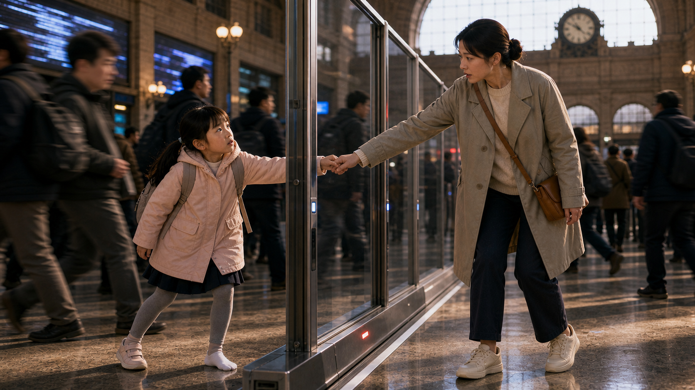

图片路径：

```text
F:\CodexSharedCockpit\episodes\season_01\episode_01\keyframes\op06_op12_director_v1\OP10-5_继续牵手会失衡_关键帧_v1.png
```

图生视频 Prompt：

```text
高精度写实 CG 渲染风，电影级悬疑情绪短剧镜头。事故当天午后静海旧北站，暖光候车大厅逐渐被冷白系统警报切开，玻璃顶棚、高窗、闸机、长椅、电子屏、中央时钟、正常人群逐步转为混乱。镜头运动克制，像真实电影摄影机，不做夸张变焦、漂浮运镜或游戏过场。人物动作以眼神、手部、停顿、保护动作和短促移动为主。保持小夏 6-7 岁东亚小女孩、黑色低位小马尾、淡粉儿童连帽外套、小书包；妈妈 30 岁左右东亚女性、黑色低发髻、浅卡其灰外套、斜挎包、温柔但清醒。OP09 起小夏右脚鞋脱落，只穿白袜，左脚仍穿淡粉米白儿童鞋。OP10-OP12 隔离门必须是两米以上高长连续玻璃与金属分区墙，从地面升起，横向贯穿大厅，不是短栏杆或闸机。

本段分镜：OP10-5，保护性松手与隔离门升起。以关键帧构图、人物站位、服装、光线和背景结构为准。画面内容：妈妈先试图把小夏往自己这边拉，但门体继续升起，继续牵手会让小夏手臂被带向金属边。 镜头运动：让观众看懂继续牵着会伤到小夏。 动作只围绕这一件事展开，不要自行换场景、换角度、增加新人物或跳到后续剧情。保持情绪克制、真实、可剪辑，最后 0.5 秒稳定在本分镜情绪落点，方便剪辑衔接。
```

负面约束：

```text
不要字幕，不要可读文字，不要水印，不要 logo，不要血腥，不要肢体伤害特写，不要夸张火球，不要恐怖鬼脸，不要二次元萌系，不要动画剧集风，不要真实偷拍感，不要换脸，不要换服装，不要多余手指，不要畸形手，不要把小夏年龄画大，不要把妈妈画成冷漠逃跑。OP09 之后不要让小夏右脚重新穿鞋。OP10-OP12 不要短栏杆、闸机、小门、可绕过隔断。妈妈松手只能是保护性松手，绝不能表现成放弃、推开、转身离开或冷漠逃走。
```

### OP10-6｜妈妈松开手，同时用另一只手护住小夏肩膀，把她挡向候车区安

关键帧图片：

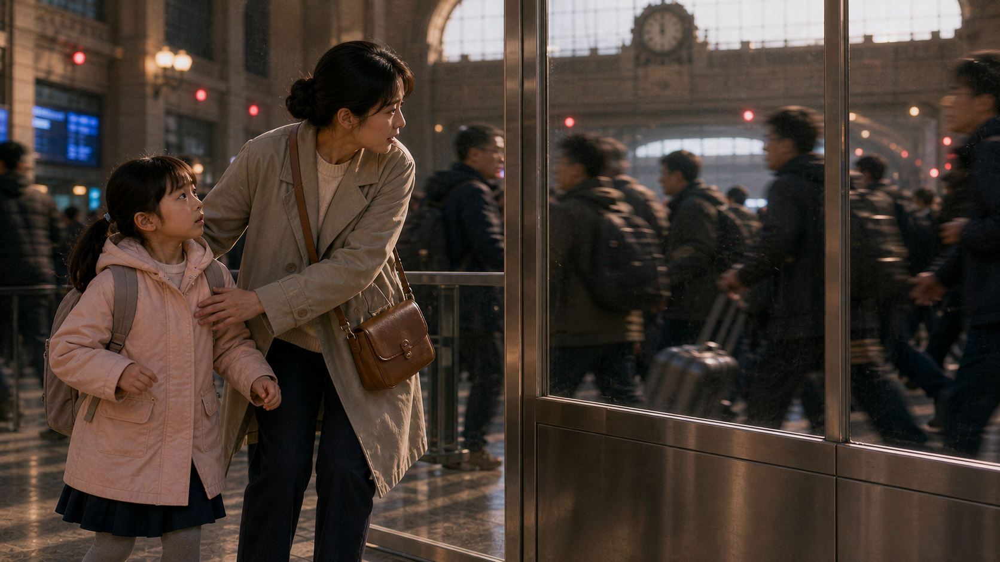

图片路径：

```text
F:\CodexSharedCockpit\episodes\season_01\episode_01\keyframes\op06_op12_director_v1\OP10-6_妈妈保护性松手护向安全侧_关键帧_v1.png
```

图生视频 Prompt：

```text
高精度写实 CG 渲染风，电影级悬疑情绪短剧镜头。事故当天午后静海旧北站，暖光候车大厅逐渐被冷白系统警报切开，玻璃顶棚、高窗、闸机、长椅、电子屏、中央时钟、正常人群逐步转为混乱。镜头运动克制，像真实电影摄影机，不做夸张变焦、漂浮运镜或游戏过场。人物动作以眼神、手部、停顿、保护动作和短促移动为主。保持小夏 6-7 岁东亚小女孩、黑色低位小马尾、淡粉儿童连帽外套、小书包；妈妈 30 岁左右东亚女性、黑色低发髻、浅卡其灰外套、斜挎包、温柔但清醒。OP09 起小夏右脚鞋脱落，只穿白袜，左脚仍穿淡粉米白儿童鞋。OP10-OP12 隔离门必须是两米以上高长连续玻璃与金属分区墙，从地面升起，横向贯穿大厅，不是短栏杆或闸机。

本段分镜：OP10-6，保护性松手与隔离门升起。以关键帧构图、人物站位、服装、光线和背景结构为准。画面内容：妈妈松开手，同时用另一只手护住小夏肩膀，把她挡向候车区安全侧。 镜头运动：核心动作：保护性松手，不能像推开或放弃。 动作只围绕这一件事展开，不要自行换场景、换角度、增加新人物或跳到后续剧情。保持情绪克制、真实、可剪辑，最后 0.5 秒稳定在本分镜情绪落点，方便剪辑衔接。
```

负面约束：

```text
不要字幕，不要可读文字，不要水印，不要 logo，不要血腥，不要肢体伤害特写，不要夸张火球，不要恐怖鬼脸，不要二次元萌系，不要动画剧集风，不要真实偷拍感，不要换脸，不要换服装，不要多余手指，不要畸形手，不要把小夏年龄画大，不要把妈妈画成冷漠逃跑。OP09 之后不要让小夏右脚重新穿鞋。OP10-OP12 不要短栏杆、闸机、小门、可绕过隔断。妈妈松手只能是保护性松手，绝不能表现成放弃、推开、转身离开或冷漠逃走。
```

### OP10-7｜小夏主观视角，妈妈被透明防爆板隔到另一侧，手还停在保护动

关键帧图片：

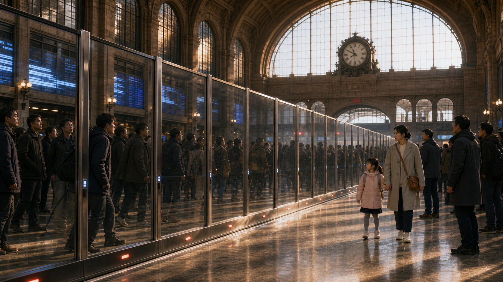

图片路径：

```text
F:\CodexSharedCockpit\episodes\season_01\episode_01\keyframes\op06_op12_director_v1\OP10-7_妈妈隔玻璃看向小夏_关键帧_v1.png
```

图生视频 Prompt：

```text
高精度写实 CG 渲染风，电影级悬疑情绪短剧镜头。事故当天午后静海旧北站，暖光候车大厅逐渐被冷白系统警报切开，玻璃顶棚、高窗、闸机、长椅、电子屏、中央时钟、正常人群逐步转为混乱。镜头运动克制，像真实电影摄影机，不做夸张变焦、漂浮运镜或游戏过场。人物动作以眼神、手部、停顿、保护动作和短促移动为主。保持小夏 6-7 岁东亚小女孩、黑色低位小马尾、淡粉儿童连帽外套、小书包；妈妈 30 岁左右东亚女性、黑色低发髻、浅卡其灰外套、斜挎包、温柔但清醒。OP09 起小夏右脚鞋脱落，只穿白袜，左脚仍穿淡粉米白儿童鞋。OP10-OP12 隔离门必须是两米以上高长连续玻璃与金属分区墙，从地面升起，横向贯穿大厅，不是短栏杆或闸机。

本段分镜：OP10-7，保护性松手与隔离门升起。以关键帧构图、人物站位、服装、光线和背景结构为准。画面内容：小夏主观视角，妈妈被透明防爆板隔到另一侧，手还停在保护动作半空。 镜头运动：观众必须看懂妈妈没有离开。 动作只围绕这一件事展开，不要自行换场景、换角度、增加新人物或跳到后续剧情。保持情绪克制、真实、可剪辑，最后 0.5 秒稳定在本分镜情绪落点，方便剪辑衔接。
```

负面约束：

```text
不要字幕，不要可读文字，不要水印，不要 logo，不要血腥，不要肢体伤害特写，不要夸张火球，不要恐怖鬼脸，不要二次元萌系，不要动画剧集风，不要真实偷拍感，不要换脸，不要换服装，不要多余手指，不要畸形手，不要把小夏年龄画大，不要把妈妈画成冷漠逃跑。OP09 之后不要让小夏右脚重新穿鞋。OP10-OP12 不要短栏杆、闸机、小门、可绕过隔断。妈妈松手只能是保护性松手，绝不能表现成放弃、推开、转身离开或冷漠逃走。
```

### OP10-8｜隔离门升到两米以上，玻璃板与金属框连续咬合，横贯大厅，母

关键帧图片：

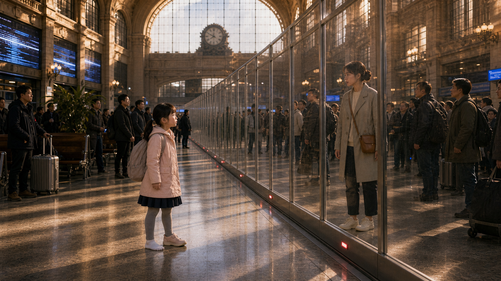

图片路径：

```text
F:\CodexSharedCockpit\episodes\season_01\episode_01\keyframes\op06_op12_director_v1\OP10-8_两米隔离门母女分处两侧_关键帧_v1.png
```

图生视频 Prompt：

```text
高精度写实 CG 渲染风，电影级悬疑情绪短剧镜头。事故当天午后静海旧北站，暖光候车大厅逐渐被冷白系统警报切开，玻璃顶棚、高窗、闸机、长椅、电子屏、中央时钟、正常人群逐步转为混乱。镜头运动克制，像真实电影摄影机，不做夸张变焦、漂浮运镜或游戏过场。人物动作以眼神、手部、停顿、保护动作和短促移动为主。保持小夏 6-7 岁东亚小女孩、黑色低位小马尾、淡粉儿童连帽外套、小书包；妈妈 30 岁左右东亚女性、黑色低发髻、浅卡其灰外套、斜挎包、温柔但清醒。OP09 起小夏右脚鞋脱落，只穿白袜，左脚仍穿淡粉米白儿童鞋。OP10-OP12 隔离门必须是两米以上高长连续玻璃与金属分区墙，从地面升起，横向贯穿大厅，不是短栏杆或闸机。

本段分镜：OP10-8，保护性松手与隔离门升起。以关键帧构图、人物站位、服装、光线和背景结构为准。画面内容：隔离门升到两米以上，玻璃板与金属框连续咬合，横贯大厅，母女分处两侧。 镜头运动：空间落点要清楚，不是短栏杆、闸机或可绕过的小门。 动作只围绕这一件事展开，不要自行换场景、换角度、增加新人物或跳到后续剧情。保持情绪克制、真实、可剪辑，最后 0.5 秒稳定在本分镜情绪落点，方便剪辑衔接。
```

负面约束：

```text
不要字幕，不要可读文字，不要水印，不要 logo，不要血腥，不要肢体伤害特写，不要夸张火球，不要恐怖鬼脸，不要二次元萌系，不要动画剧集风，不要真实偷拍感，不要换脸，不要换服装，不要多余手指，不要畸形手，不要把小夏年龄画大，不要把妈妈画成冷漠逃跑。OP09 之后不要让小夏右脚重新穿鞋。OP10-OP12 不要短栏杆、闸机、小门、可绕过隔断。妈妈松手只能是保护性松手，绝不能表现成放弃、推开、转身离开或冷漠逃走。
```

---

## OP11｜隔离门锁死，妈妈敲门安抚

### OP11-1｜门框细节近景，隔离门锁死，红色小锁定灯沿金属框依次亮起。

关键帧图片：


图片路径：

```text
F:\CodexSharedCockpit\episodes\season_01\episode_01\keyframes\op06_op12_director_v1\OP11-1_隔离门锁定红灯_关键帧_v1.png
```

图生视频 Prompt：

```text
高精度写实 CG 渲染风，电影级悬疑情绪短剧镜头。事故当天午后静海旧北站，暖光候车大厅逐渐被冷白系统警报切开，玻璃顶棚、高窗、闸机、长椅、电子屏、中央时钟、正常人群逐步转为混乱。镜头运动克制，像真实电影摄影机，不做夸张变焦、漂浮运镜或游戏过场。人物动作以眼神、手部、停顿、保护动作和短促移动为主。保持小夏 6-7 岁东亚小女孩、黑色低位小马尾、淡粉儿童连帽外套、小书包；妈妈 30 岁左右东亚女性、黑色低发髻、浅卡其灰外套、斜挎包、温柔但清醒。OP09 起小夏右脚鞋脱落，只穿白袜，左脚仍穿淡粉米白儿童鞋。OP10-OP12 隔离门必须是两米以上高长连续玻璃与金属分区墙，从地面升起，横向贯穿大厅，不是短栏杆或闸机。

本段分镜：OP11-1，隔离门锁死，妈妈敲门安抚。以关键帧构图、人物站位、服装、光线和背景结构为准。画面内容：门框细节近景，隔离门锁死，红色小锁定灯沿金属框依次亮起。 镜头运动：建立打不开，按钮声和锁定声清楚。 动作只围绕这一件事展开，不要自行换场景、换角度、增加新人物或跳到后续剧情。保持情绪克制、真实、可剪辑，最后 0.5 秒稳定在本分镜情绪落点，方便剪辑衔接。
```

负面约束：

```text
不要字幕，不要可读文字，不要水印，不要 logo，不要血腥，不要肢体伤害特写，不要夸张火球，不要恐怖鬼脸，不要二次元萌系，不要动画剧集风，不要真实偷拍感，不要换脸，不要换服装，不要多余手指，不要畸形手，不要把小夏年龄画大，不要把妈妈画成冷漠逃跑。OP09 之后不要让小夏右脚重新穿鞋。OP10-OP12 不要短栏杆、闸机、小门、可绕过隔断。妈妈松手只能是保护性松手，绝不能表现成放弃、推开、转身离开或冷漠逃走。
```

### OP11-2｜小夏站在候车区安全侧，手贴透明板，右脚白袜缩在身后，左脚

关键帧图片：

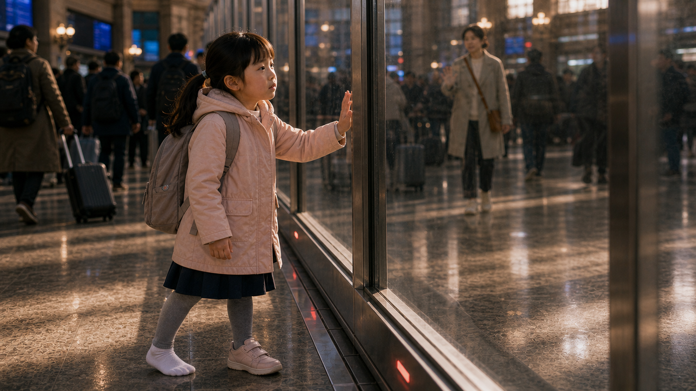

图片路径：

```text
F:\CodexSharedCockpit\episodes\season_01\episode_01\keyframes\op06_op12_director_v1\OP11-2_小夏安全侧手贴玻璃_关键帧_v1.png
```

图生视频 Prompt：

```text
高精度写实 CG 渲染风，电影级悬疑情绪短剧镜头。事故当天午后静海旧北站，暖光候车大厅逐渐被冷白系统警报切开，玻璃顶棚、高窗、闸机、长椅、电子屏、中央时钟、正常人群逐步转为混乱。镜头运动克制，像真实电影摄影机，不做夸张变焦、漂浮运镜或游戏过场。人物动作以眼神、手部、停顿、保护动作和短促移动为主。保持小夏 6-7 岁东亚小女孩、黑色低位小马尾、淡粉儿童连帽外套、小书包；妈妈 30 岁左右东亚女性、黑色低发髻、浅卡其灰外套、斜挎包、温柔但清醒。OP09 起小夏右脚鞋脱落，只穿白袜，左脚仍穿淡粉米白儿童鞋。OP10-OP12 隔离门必须是两米以上高长连续玻璃与金属分区墙，从地面升起，横向贯穿大厅，不是短栏杆或闸机。

本段分镜：OP11-2，隔离门锁死，妈妈敲门安抚。以关键帧构图、人物站位、服装、光线和背景结构为准。画面内容：小夏站在候车区安全侧，手贴透明板，右脚白袜缩在身后，左脚单鞋。 镜头运动：她发怔，不是马上崩溃。 动作只围绕这一件事展开，不要自行换场景、换角度、增加新人物或跳到后续剧情。保持情绪克制、真实、可剪辑，最后 0.5 秒稳定在本分镜情绪落点，方便剪辑衔接。
```

负面约束：

```text
不要字幕，不要可读文字，不要水印，不要 logo，不要血腥，不要肢体伤害特写，不要夸张火球，不要恐怖鬼脸，不要二次元萌系，不要动画剧集风，不要真实偷拍感，不要换脸，不要换服装，不要多余手指，不要畸形手，不要把小夏年龄画大，不要把妈妈画成冷漠逃跑。OP09 之后不要让小夏右脚重新穿鞋。OP10-OP12 不要短栏杆、闸机、小门、可绕过隔断。妈妈松手只能是保护性松手，绝不能表现成放弃、推开、转身离开或冷漠逃走。
```

### OP11-3｜妈妈冲回门前，双手重重拍在透明板上，隔着玻璃看小夏。

关键帧图片：

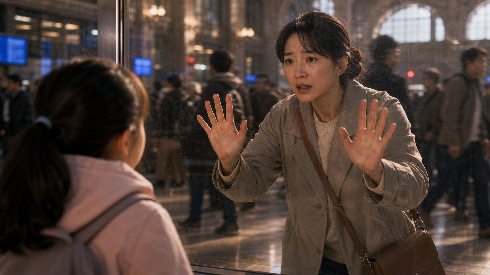

图片路径：

```text
F:\CodexSharedCockpit\episodes\season_01\episode_01\keyframes\op06_op12_director_v1\OP11-3_妈妈隔玻璃用力敲门_关键帧_v1.png
```

图生视频 Prompt：

```text
高精度写实 CG 渲染风，电影级悬疑情绪短剧镜头。事故当天午后静海旧北站，暖光候车大厅逐渐被冷白系统警报切开，玻璃顶棚、高窗、闸机、长椅、电子屏、中央时钟、正常人群逐步转为混乱。镜头运动克制，像真实电影摄影机，不做夸张变焦、漂浮运镜或游戏过场。人物动作以眼神、手部、停顿、保护动作和短促移动为主。保持小夏 6-7 岁东亚小女孩、黑色低位小马尾、淡粉儿童连帽外套、小书包；妈妈 30 岁左右东亚女性、黑色低发髻、浅卡其灰外套、斜挎包、温柔但清醒。OP09 起小夏右脚鞋脱落，只穿白袜，左脚仍穿淡粉米白儿童鞋。OP10-OP12 隔离门必须是两米以上高长连续玻璃与金属分区墙，从地面升起，横向贯穿大厅，不是短栏杆或闸机。

本段分镜：OP11-3，隔离门锁死，妈妈敲门安抚。以关键帧构图、人物站位、服装、光线和背景结构为准。画面内容：妈妈冲回门前，双手重重拍在透明板上，隔着玻璃看小夏。 镜头运动：妈妈急切但眼神清醒，不是无措乱拍。 动作只围绕这一件事展开，不要自行换场景、换角度、增加新人物或跳到后续剧情。保持情绪克制、真实、可剪辑，最后 0.5 秒稳定在本分镜情绪落点，方便剪辑衔接。
```

负面约束：

```text
不要字幕，不要可读文字，不要水印，不要 logo，不要血腥，不要肢体伤害特写，不要夸张火球，不要恐怖鬼脸，不要二次元萌系，不要动画剧集风，不要真实偷拍感，不要换脸，不要换服装，不要多余手指，不要畸形手，不要把小夏年龄画大，不要把妈妈画成冷漠逃跑。OP09 之后不要让小夏右脚重新穿鞋。OP10-OP12 不要短栏杆、闸机、小门、可绕过隔断。妈妈松手只能是保护性松手，绝不能表现成放弃、推开、转身离开或冷漠逃走。
```

### OP11-4｜小夏肩后反打，妈妈隔着玻璃对小夏说话，努力稳住表情。

关键帧图片：

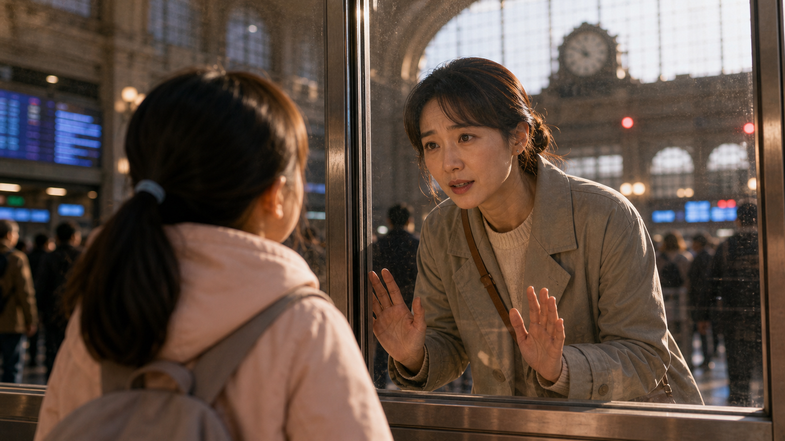

图片路径：

```text
F:\CodexSharedCockpit\episodes\season_01\episode_01\keyframes\op06_op12_director_v1\OP11-4_小夏肩后看妈妈隔门安抚_关键帧_v1.png
```

图生视频 Prompt：

```text
高精度写实 CG 渲染风，电影级悬疑情绪短剧镜头。事故当天午后静海旧北站，暖光候车大厅逐渐被冷白系统警报切开，玻璃顶棚、高窗、闸机、长椅、电子屏、中央时钟、正常人群逐步转为混乱。镜头运动克制，像真实电影摄影机，不做夸张变焦、漂浮运镜或游戏过场。人物动作以眼神、手部、停顿、保护动作和短促移动为主。保持小夏 6-7 岁东亚小女孩、黑色低位小马尾、淡粉儿童连帽外套、小书包；妈妈 30 岁左右东亚女性、黑色低发髻、浅卡其灰外套、斜挎包、温柔但清醒。OP09 起小夏右脚鞋脱落，只穿白袜，左脚仍穿淡粉米白儿童鞋。OP10-OP12 隔离门必须是两米以上高长连续玻璃与金属分区墙，从地面升起，横向贯穿大厅，不是短栏杆或闸机。

本段分镜：OP11-4，隔离门锁死，妈妈敲门安抚。以关键帧构图、人物站位、服装、光线和背景结构为准。画面内容：小夏肩后反打，妈妈隔着玻璃对小夏说话，努力稳住表情。 镜头运动：母女反打是情绪关键，留后期安慰台词空间。 动作只围绕这一件事展开，不要自行换场景、换角度、增加新人物或跳到后续剧情。保持情绪克制、真实、可剪辑，最后 0.5 秒稳定在本分镜情绪落点，方便剪辑衔接。
```

负面约束：

```text
不要字幕，不要可读文字，不要水印，不要 logo，不要血腥，不要肢体伤害特写，不要夸张火球，不要恐怖鬼脸，不要二次元萌系，不要动画剧集风，不要真实偷拍感，不要换脸，不要换服装，不要多余手指，不要畸形手，不要把小夏年龄画大，不要把妈妈画成冷漠逃跑。OP09 之后不要让小夏右脚重新穿鞋。OP10-OP12 不要短栏杆、闸机、小门、可绕过隔断。妈妈松手只能是保护性松手，绝不能表现成放弃、推开、转身离开或冷漠逃走。
```

### OP11-5｜妈妈转头扫视门侧，寻找应急开关或控制盒。

关键帧图片：

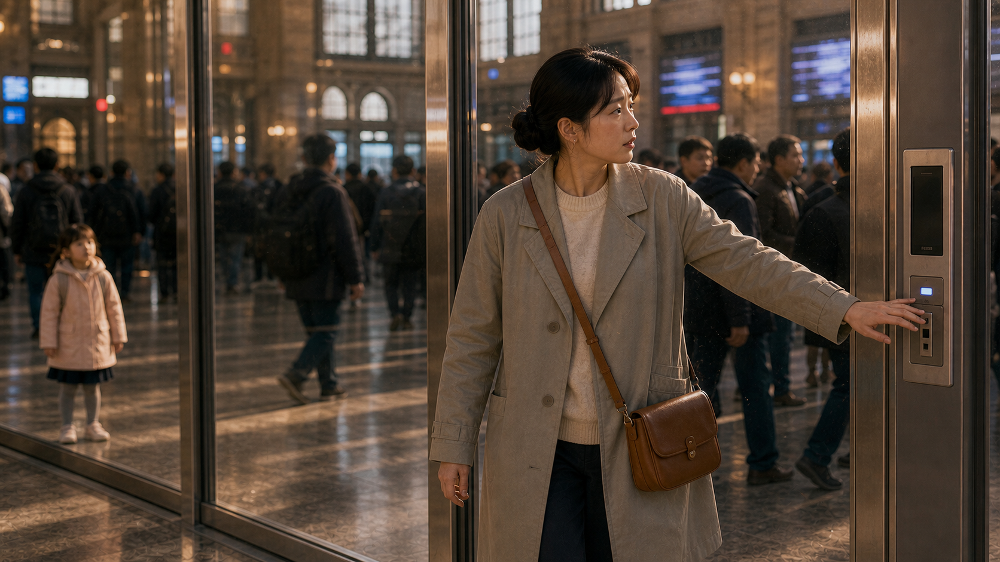

图片路径：

```text
F:\CodexSharedCockpit\episodes\season_01\episode_01\keyframes\op06_op12_director_v1\OP11-5_妈妈寻找应急开关_关键帧_v1.png
```

图生视频 Prompt：

```text
高精度写实 CG 渲染风，电影级悬疑情绪短剧镜头。事故当天午后静海旧北站，暖光候车大厅逐渐被冷白系统警报切开，玻璃顶棚、高窗、闸机、长椅、电子屏、中央时钟、正常人群逐步转为混乱。镜头运动克制，像真实电影摄影机，不做夸张变焦、漂浮运镜或游戏过场。人物动作以眼神、手部、停顿、保护动作和短促移动为主。保持小夏 6-7 岁东亚小女孩、黑色低位小马尾、淡粉儿童连帽外套、小书包；妈妈 30 岁左右东亚女性、黑色低发髻、浅卡其灰外套、斜挎包、温柔但清醒。OP09 起小夏右脚鞋脱落，只穿白袜，左脚仍穿淡粉米白儿童鞋。OP10-OP12 隔离门必须是两米以上高长连续玻璃与金属分区墙，从地面升起，横向贯穿大厅，不是短栏杆或闸机。

本段分镜：OP11-5，隔离门锁死，妈妈敲门安抚。以关键帧构图、人物站位、服装、光线和背景结构为准。画面内容：妈妈转头扫视门侧，寻找应急开关或控制盒。 镜头运动：她在行动，不是原地乱拍。 动作只围绕这一件事展开，不要自行换场景、换角度、增加新人物或跳到后续剧情。保持情绪克制、真实、可剪辑，最后 0.5 秒稳定在本分镜情绪落点，方便剪辑衔接。
```

负面约束：

```text
不要字幕，不要可读文字，不要水印，不要 logo，不要血腥，不要肢体伤害特写，不要夸张火球，不要恐怖鬼脸，不要二次元萌系，不要动画剧集风，不要真实偷拍感，不要换脸，不要换服装，不要多余手指，不要畸形手，不要把小夏年龄画大，不要把妈妈画成冷漠逃跑。OP09 之后不要让小夏右脚重新穿鞋。OP10-OP12 不要短栏杆、闸机、小门、可绕过隔断。妈妈松手只能是保护性松手，绝不能表现成放弃、推开、转身离开或冷漠逃走。
```

### OP11-6｜妈妈按下门侧应急按钮或拉动机械开关，按钮闪红失灵。

关键帧图片：


图片路径：

```text
F:\CodexSharedCockpit\episodes\season_01\episode_01\keyframes\op06_op12_director_v1\OP11-6_应急开关红灯失灵_关键帧_v1.png
```

图生视频 Prompt：

```text
高精度写实 CG 渲染风，电影级悬疑情绪短剧镜头。事故当天午后静海旧北站，暖光候车大厅逐渐被冷白系统警报切开，玻璃顶棚、高窗、闸机、长椅、电子屏、中央时钟、正常人群逐步转为混乱。镜头运动克制，像真实电影摄影机，不做夸张变焦、漂浮运镜或游戏过场。人物动作以眼神、手部、停顿、保护动作和短促移动为主。保持小夏 6-7 岁东亚小女孩、黑色低位小马尾、淡粉儿童连帽外套、小书包；妈妈 30 岁左右东亚女性、黑色低发髻、浅卡其灰外套、斜挎包、温柔但清醒。OP09 起小夏右脚鞋脱落，只穿白袜，左脚仍穿淡粉米白儿童鞋。OP10-OP12 隔离门必须是两米以上高长连续玻璃与金属分区墙，从地面升起，横向贯穿大厅，不是短栏杆或闸机。

本段分镜：OP11-6，隔离门锁死，妈妈敲门安抚。以关键帧构图、人物站位、服装、光线和背景结构为准。画面内容：妈妈按下门侧应急按钮或拉动机械开关，按钮闪红失灵。 镜头运动：具体动作要清楚，证明门打不开。 动作只围绕这一件事展开，不要自行换场景、换角度、增加新人物或跳到后续剧情。保持情绪克制、真实、可剪辑，最后 0.5 秒稳定在本分镜情绪落点，方便剪辑衔接。
```

负面约束：

```text
不要字幕，不要可读文字，不要水印，不要 logo，不要血腥，不要肢体伤害特写，不要夸张火球，不要恐怖鬼脸，不要二次元萌系，不要动画剧集风，不要真实偷拍感，不要换脸，不要换服装，不要多余手指，不要畸形手，不要把小夏年龄画大，不要把妈妈画成冷漠逃跑。OP09 之后不要让小夏右脚重新穿鞋。OP10-OP12 不要短栏杆、闸机、小门、可绕过隔断。妈妈松手只能是保护性松手，绝不能表现成放弃、推开、转身离开或冷漠逃走。
```

### OP11-7｜妈妈身后人潮再次反冲，她被撞一下仍朝小夏方向撑住。

关键帧图片：

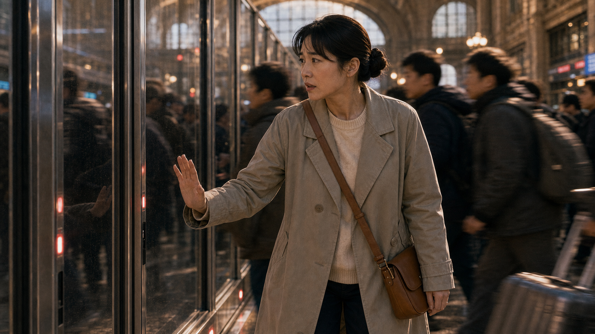

图片路径：

```text
F:\CodexSharedCockpit\episodes\season_01\episode_01\keyframes\op06_op12_director_v1\OP11-7_妈妈身后人潮逼近_关键帧_v1.png
```

图生视频 Prompt：

```text
高精度写实 CG 渲染风，电影级悬疑情绪短剧镜头。事故当天午后静海旧北站，暖光候车大厅逐渐被冷白系统警报切开，玻璃顶棚、高窗、闸机、长椅、电子屏、中央时钟、正常人群逐步转为混乱。镜头运动克制，像真实电影摄影机，不做夸张变焦、漂浮运镜或游戏过场。人物动作以眼神、手部、停顿、保护动作和短促移动为主。保持小夏 6-7 岁东亚小女孩、黑色低位小马尾、淡粉儿童连帽外套、小书包；妈妈 30 岁左右东亚女性、黑色低发髻、浅卡其灰外套、斜挎包、温柔但清醒。OP09 起小夏右脚鞋脱落，只穿白袜，左脚仍穿淡粉米白儿童鞋。OP10-OP12 隔离门必须是两米以上高长连续玻璃与金属分区墙，从地面升起，横向贯穿大厅，不是短栏杆或闸机。

本段分镜：OP11-7，隔离门锁死，妈妈敲门安抚。以关键帧构图、人物站位、服装、光线和背景结构为准。画面内容：妈妈身后人潮再次反冲，她被撞一下仍朝小夏方向撑住。 镜头运动：为 OP12 被带走做前兆，妈妈仍朝向小夏。 动作只围绕这一件事展开，不要自行换场景、换角度、增加新人物或跳到后续剧情。保持情绪克制、真实、可剪辑，最后 0.5 秒稳定在本分镜情绪落点，方便剪辑衔接。
```

负面约束：

```text
不要字幕，不要可读文字，不要水印，不要 logo，不要血腥，不要肢体伤害特写，不要夸张火球，不要恐怖鬼脸，不要二次元萌系，不要动画剧集风，不要真实偷拍感，不要换脸，不要换服装，不要多余手指，不要畸形手，不要把小夏年龄画大，不要把妈妈画成冷漠逃跑。OP09 之后不要让小夏右脚重新穿鞋。OP10-OP12 不要短栏杆、闸机、小门、可绕过隔断。妈妈松手只能是保护性松手，绝不能表现成放弃、推开、转身离开或冷漠逃走。
```

---

## OP12｜人潮推远，坍塌吞声

### OP12-1｜妈妈被人潮带往反方向，但脸仍转向小夏。

关键帧图片：

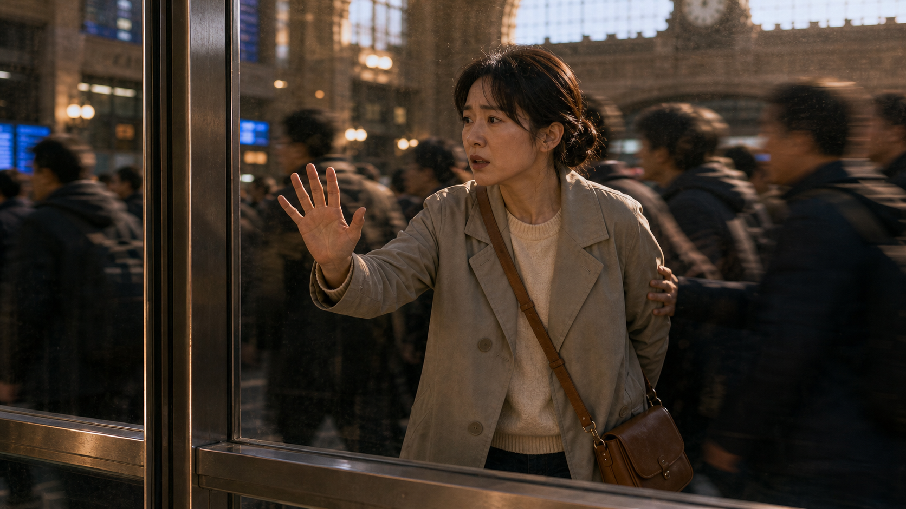

图片路径：

```text
F:\CodexSharedCockpit\episodes\season_01\episode_01\keyframes\op06_op12_director_v1\OP12-1_妈妈被人潮带远仍朝向小夏_关键帧_v1.png
```

图生视频 Prompt：

```text
高精度写实 CG 渲染风，电影级悬疑情绪短剧镜头。事故当天午后静海旧北站，暖光候车大厅逐渐被冷白系统警报切开，玻璃顶棚、高窗、闸机、长椅、电子屏、中央时钟、正常人群逐步转为混乱。镜头运动克制，像真实电影摄影机，不做夸张变焦、漂浮运镜或游戏过场。人物动作以眼神、手部、停顿、保护动作和短促移动为主。保持小夏 6-7 岁东亚小女孩、黑色低位小马尾、淡粉儿童连帽外套、小书包；妈妈 30 岁左右东亚女性、黑色低发髻、浅卡其灰外套、斜挎包、温柔但清醒。OP09 起小夏右脚鞋脱落，只穿白袜，左脚仍穿淡粉米白儿童鞋。OP10-OP12 隔离门必须是两米以上高长连续玻璃与金属分区墙，从地面升起，横向贯穿大厅，不是短栏杆或闸机。

本段分镜：OP12-1，人潮推远，坍塌吞声。以关键帧构图、人物站位、服装、光线和背景结构为准。画面内容：妈妈被人潮带往反方向，但脸仍转向小夏。 镜头运动：不是主动离开，是被带走。 动作只围绕这一件事展开，不要自行换场景、换角度、增加新人物或跳到后续剧情。保持情绪克制、真实、可剪辑，最后 0.5 秒稳定在本分镜情绪落点，方便剪辑衔接。
```

负面约束：

```text
不要字幕，不要可读文字，不要水印，不要 logo，不要血腥，不要肢体伤害特写，不要夸张火球，不要恐怖鬼脸，不要二次元萌系，不要动画剧集风，不要真实偷拍感，不要换脸，不要换服装，不要多余手指，不要畸形手，不要把小夏年龄画大，不要把妈妈画成冷漠逃跑。OP09 之后不要让小夏右脚重新穿鞋。OP10-OP12 不要短栏杆、闸机、小门、可绕过隔断。妈妈松手只能是保护性松手，绝不能表现成放弃、推开、转身离开或冷漠逃走。
```

### OP12-2｜小夏隔着门看妈妈被推远，手贴玻璃，右脚白袜和左脚单鞋仍保

关键帧图片：

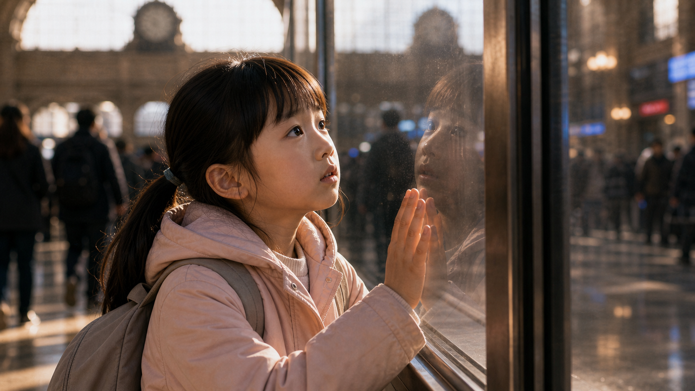

图片路径：

```text
F:\CodexSharedCockpit\episodes\season_01\episode_01\keyframes\op06_op12_director_v1\OP12-2_小夏隔玻璃手贴门停顿_关键帧_v1.png
```

图生视频 Prompt：

```text
高精度写实 CG 渲染风，电影级悬疑情绪短剧镜头。事故当天午后静海旧北站，暖光候车大厅逐渐被冷白系统警报切开，玻璃顶棚、高窗、闸机、长椅、电子屏、中央时钟、正常人群逐步转为混乱。镜头运动克制，像真实电影摄影机，不做夸张变焦、漂浮运镜或游戏过场。人物动作以眼神、手部、停顿、保护动作和短促移动为主。保持小夏 6-7 岁东亚小女孩、黑色低位小马尾、淡粉儿童连帽外套、小书包；妈妈 30 岁左右东亚女性、黑色低发髻、浅卡其灰外套、斜挎包、温柔但清醒。OP09 起小夏右脚鞋脱落，只穿白袜，左脚仍穿淡粉米白儿童鞋。OP10-OP12 隔离门必须是两米以上高长连续玻璃与金属分区墙，从地面升起，横向贯穿大厅，不是短栏杆或闸机。

本段分镜：OP12-2，人潮推远，坍塌吞声。以关键帧构图、人物站位、服装、光线和背景结构为准。画面内容：小夏隔着门看妈妈被推远，手贴玻璃，右脚白袜和左脚单鞋仍保持连续。 镜头运动：停顿很重要，不要立刻奔跑。 动作只围绕这一件事展开，不要自行换场景、换角度、增加新人物或跳到后续剧情。保持情绪克制、真实、可剪辑，最后 0.5 秒稳定在本分镜情绪落点，方便剪辑衔接。
```

负面约束：

```text
不要字幕，不要可读文字，不要水印，不要 logo，不要血腥，不要肢体伤害特写，不要夸张火球，不要恐怖鬼脸，不要二次元萌系，不要动画剧集风，不要真实偷拍感，不要换脸，不要换服装，不要多余手指，不要畸形手，不要把小夏年龄画大，不要把妈妈画成冷漠逃跑。OP09 之后不要让小夏右脚重新穿鞋。OP10-OP12 不要短栏杆、闸机、小门、可绕过隔断。妈妈松手只能是保护性松手，绝不能表现成放弃、推开、转身离开或冷漠逃走。
```

### OP12-3｜长焦中景，妈妈在人群中被压缩，努力逆着人潮伸手。

关键帧图片：

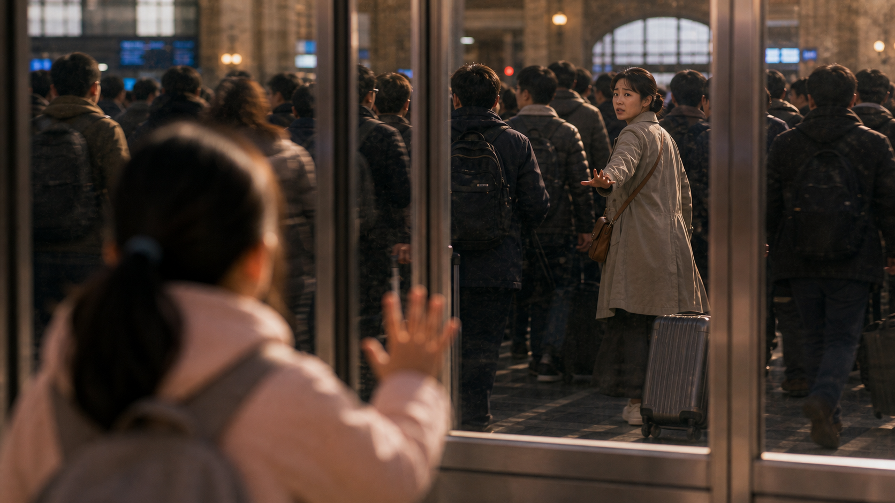

图片路径：

```text
F:\CodexSharedCockpit\episodes\season_01\episode_01\keyframes\op06_op12_director_v1\OP12-3_妈妈在人潮中回身伸手_关键帧_v1.png
```

图生视频 Prompt：

```text
高精度写实 CG 渲染风，电影级悬疑情绪短剧镜头。事故当天午后静海旧北站，暖光候车大厅逐渐被冷白系统警报切开，玻璃顶棚、高窗、闸机、长椅、电子屏、中央时钟、正常人群逐步转为混乱。镜头运动克制，像真实电影摄影机，不做夸张变焦、漂浮运镜或游戏过场。人物动作以眼神、手部、停顿、保护动作和短促移动为主。保持小夏 6-7 岁东亚小女孩、黑色低位小马尾、淡粉儿童连帽外套、小书包；妈妈 30 岁左右东亚女性、黑色低发髻、浅卡其灰外套、斜挎包、温柔但清醒。OP09 起小夏右脚鞋脱落，只穿白袜，左脚仍穿淡粉米白儿童鞋。OP10-OP12 隔离门必须是两米以上高长连续玻璃与金属分区墙，从地面升起，横向贯穿大厅，不是短栏杆或闸机。

本段分镜：OP12-3，人潮推远，坍塌吞声。以关键帧构图、人物站位、服装、光线和背景结构为准。画面内容：长焦中景，妈妈在人群中被压缩，努力逆着人潮伸手。 镜头运动：人群像墙一样，妈妈越来越难靠近。 动作只围绕这一件事展开，不要自行换场景、换角度、增加新人物或跳到后续剧情。保持情绪克制、真实、可剪辑，最后 0.5 秒稳定在本分镜情绪落点，方便剪辑衔接。
```

负面约束：

```text
不要字幕，不要可读文字，不要水印，不要 logo，不要血腥，不要肢体伤害特写，不要夸张火球，不要恐怖鬼脸，不要二次元萌系，不要动画剧集风，不要真实偷拍感，不要换脸，不要换服装，不要多余手指，不要畸形手，不要把小夏年龄画大，不要把妈妈画成冷漠逃跑。OP09 之后不要让小夏右脚重新穿鞋。OP10-OP12 不要短栏杆、闸机、小门、可绕过隔断。妈妈松手只能是保护性松手，绝不能表现成放弃、推开、转身离开或冷漠逃走。
```

### OP12-4｜小夏听见妈妈喊回候车区等的前半句后，眼睛动了一下，不知道

关键帧图片：

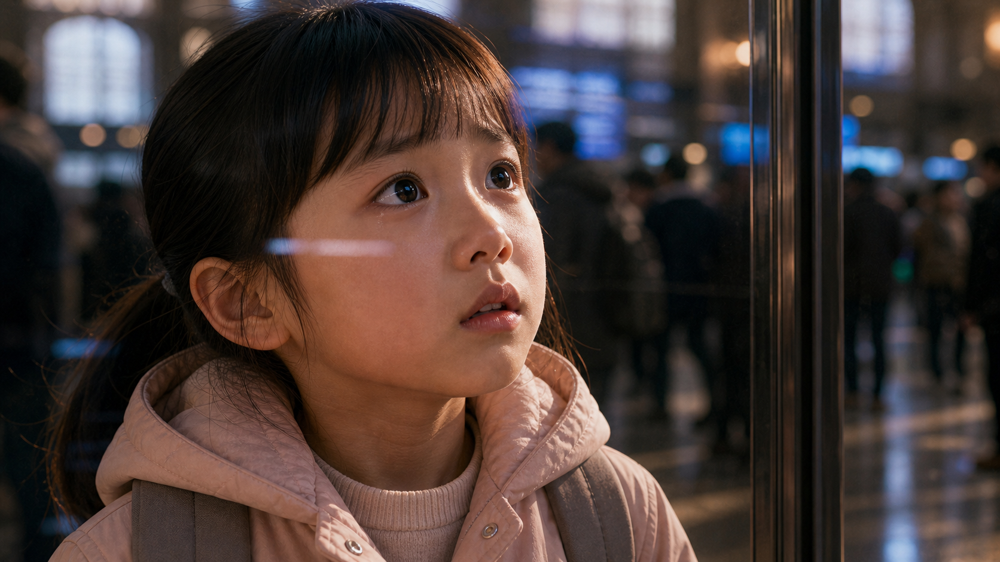

图片路径：

```text
F:\CodexSharedCockpit\episodes\season_01\episode_01\keyframes\op06_op12_director_v1\OP12-4_小夏听见残缺指令后停顿_关键帧_v1.png
```

图生视频 Prompt：

```text
高精度写实 CG 渲染风，电影级悬疑情绪短剧镜头。事故当天午后静海旧北站，暖光候车大厅逐渐被冷白系统警报切开，玻璃顶棚、高窗、闸机、长椅、电子屏、中央时钟、正常人群逐步转为混乱。镜头运动克制，像真实电影摄影机，不做夸张变焦、漂浮运镜或游戏过场。人物动作以眼神、手部、停顿、保护动作和短促移动为主。保持小夏 6-7 岁东亚小女孩、黑色低位小马尾、淡粉儿童连帽外套、小书包；妈妈 30 岁左右东亚女性、黑色低发髻、浅卡其灰外套、斜挎包、温柔但清醒。OP09 起小夏右脚鞋脱落，只穿白袜，左脚仍穿淡粉米白儿童鞋。OP10-OP12 隔离门必须是两米以上高长连续玻璃与金属分区墙，从地面升起，横向贯穿大厅，不是短栏杆或闸机。

本段分镜：OP12-4，人潮推远，坍塌吞声。以关键帧构图、人物站位、服装、光线和背景结构为准。画面内容：小夏听见妈妈喊回候车区等的前半句后，眼睛动了一下，不知道该不该走。 镜头运动：情绪主镜头，玻璃反光压在眼睛上。 动作只围绕这一件事展开，不要自行换场景、换角度、增加新人物或跳到后续剧情。保持情绪克制、真实、可剪辑，最后 0.5 秒稳定在本分镜情绪落点，方便剪辑衔接。
```

负面约束：

```text
不要字幕，不要可读文字，不要水印，不要 logo，不要血腥，不要肢体伤害特写，不要夸张火球，不要恐怖鬼脸，不要二次元萌系，不要动画剧集风，不要真实偷拍感，不要换脸，不要换服装，不要多余手指，不要畸形手，不要把小夏年龄画大，不要把妈妈画成冷漠逃跑。OP09 之后不要让小夏右脚重新穿鞋。OP10-OP12 不要短栏杆、闸机、小门、可绕过隔断。妈妈松手只能是保护性松手，绝不能表现成放弃、推开、转身离开或冷漠逃走。
```

### OP12-6｜小夏肩后远景，隔着两米以上玻璃隔离墙，看见妈妈方向被冷白

关键帧图片：

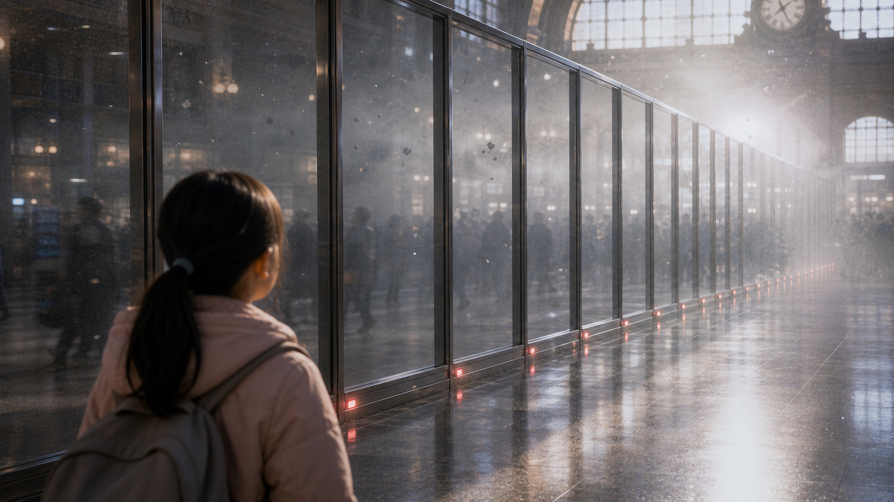

图片路径：

```text
F:\CodexSharedCockpit\episodes\season_01\episode_01\keyframes\op06_op12_director_v1\OP12-6_冷白光灰尘吞没后半句_关键帧_v1.png
```

图生视频 Prompt：

```text
高精度写实 CG 渲染风，电影级悬疑情绪短剧镜头。事故当天午后静海旧北站，暖光候车大厅逐渐被冷白系统警报切开，玻璃顶棚、高窗、闸机、长椅、电子屏、中央时钟、正常人群逐步转为混乱。镜头运动克制，像真实电影摄影机，不做夸张变焦、漂浮运镜或游戏过场。人物动作以眼神、手部、停顿、保护动作和短促移动为主。保持小夏 6-7 岁东亚小女孩、黑色低位小马尾、淡粉儿童连帽外套、小书包；妈妈 30 岁左右东亚女性、黑色低发髻、浅卡其灰外套、斜挎包、温柔但清醒。OP09 起小夏右脚鞋脱落，只穿白袜，左脚仍穿淡粉米白儿童鞋。OP10-OP12 隔离门必须是两米以上高长连续玻璃与金属分区墙，从地面升起，横向贯穿大厅，不是短栏杆或闸机。

本段分镜：OP12-6，人潮推远，坍塌吞声。以关键帧构图、人物站位、服装、光线和背景结构为准。画面内容：小夏肩后远景，隔着两米以上玻璃隔离墙，看见妈妈方向被冷白强光、灰尘、玻璃反射吞没。 镜头运动：不要直给伤害，不要火球，用冷白光和灰尘吞掉后半句。 动作只围绕这一件事展开，不要自行换场景、换角度、增加新人物或跳到后续剧情。保持情绪克制、真实、可剪辑，最后 0.5 秒稳定在本分镜情绪落点，方便剪辑衔接。
```

负面约束：

```text
不要字幕，不要可读文字，不要水印，不要 logo，不要血腥，不要肢体伤害特写，不要夸张火球，不要恐怖鬼脸，不要二次元萌系，不要动画剧集风，不要真实偷拍感，不要换脸，不要换服装，不要多余手指，不要畸形手，不要把小夏年龄画大，不要把妈妈画成冷漠逃跑。OP09 之后不要让小夏右脚重新穿鞋。OP10-OP12 不要短栏杆、闸机、小门、可绕过隔断。妈妈松手只能是保护性松手，绝不能表现成放弃、推开、转身离开或冷漠逃走。
```

### OP12-7｜低机位跟脚，小夏突然跑向隔离门，右脚白袜和左脚单鞋交替落

关键帧图片：

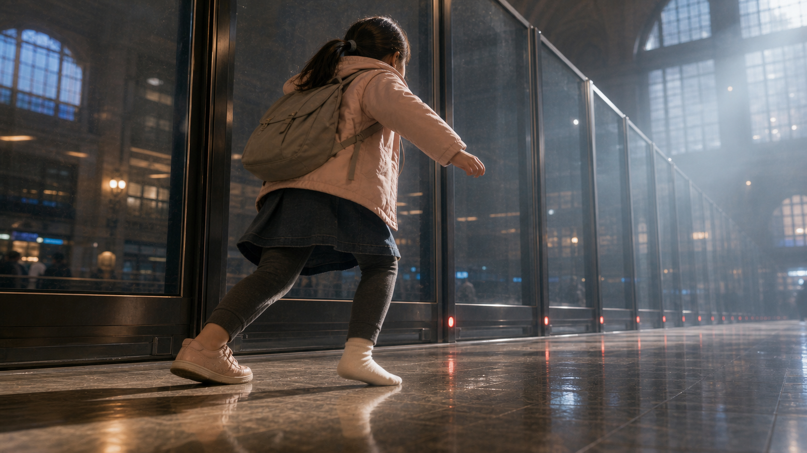

图片路径：

```text
F:\CodexSharedCockpit\episodes\season_01\episode_01\keyframes\op06_op12_director_v1\OP12-7_小夏低机位跑向隔离门_关键帧_v1.png
```

图生视频 Prompt：

```text
高精度写实 CG 渲染风，电影级悬疑情绪短剧镜头。事故当天午后静海旧北站，暖光候车大厅逐渐被冷白系统警报切开，玻璃顶棚、高窗、闸机、长椅、电子屏、中央时钟、正常人群逐步转为混乱。镜头运动克制，像真实电影摄影机，不做夸张变焦、漂浮运镜或游戏过场。人物动作以眼神、手部、停顿、保护动作和短促移动为主。保持小夏 6-7 岁东亚小女孩、黑色低位小马尾、淡粉儿童连帽外套、小书包；妈妈 30 岁左右东亚女性、黑色低发髻、浅卡其灰外套、斜挎包、温柔但清醒。OP09 起小夏右脚鞋脱落，只穿白袜，左脚仍穿淡粉米白儿童鞋。OP10-OP12 隔离门必须是两米以上高长连续玻璃与金属分区墙，从地面升起，横向贯穿大厅，不是短栏杆或闸机。

本段分镜：OP12-7，人潮推远，坍塌吞声。以关键帧构图、人物站位、服装、光线和背景结构为准。画面内容：低机位跟脚，小夏突然跑向隔离门，右脚白袜和左脚单鞋交替落地。 镜头运动：脚步短促、慌乱、有痛感，不能重新穿上右脚鞋。 动作只围绕这一件事展开，不要自行换场景、换角度、增加新人物或跳到后续剧情。保持情绪克制、真实、可剪辑，最后 0.5 秒稳定在本分镜情绪落点，方便剪辑衔接。
```

负面约束：

```text
不要字幕，不要可读文字，不要水印，不要 logo，不要血腥，不要肢体伤害特写，不要夸张火球，不要恐怖鬼脸，不要二次元萌系，不要动画剧集风，不要真实偷拍感，不要换脸，不要换服装，不要多余手指，不要畸形手，不要把小夏年龄画大，不要把妈妈画成冷漠逃跑。OP09 之后不要让小夏右脚重新穿鞋。OP10-OP12 不要短栏杆、闸机、小门、可绕过隔断。妈妈松手只能是保护性松手，绝不能表现成放弃、推开、转身离开或冷漠逃走。
```

### OP12-5｜低机位固定，掉落的淡粉米白儿童鞋特写，画面无人，声音消失

关键帧图片：

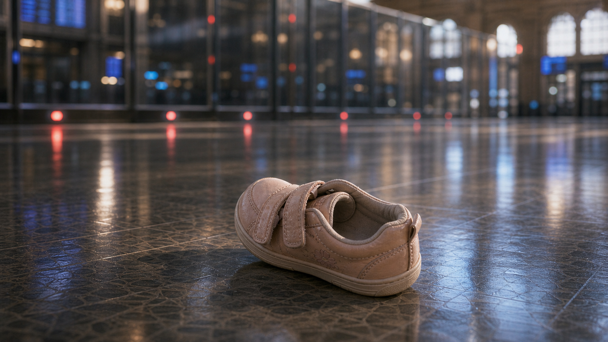

图片路径：

```text
F:\CodexSharedCockpit\episodes\season_01\episode_01\keyframes\op06_op12_director_v1\OP12-5_无人鞋静音定格_关键帧_v1.png
```

图生视频 Prompt：

```text
高精度写实 CG 渲染风，电影级悬疑情绪短剧镜头。事故当天午后静海旧北站，暖光候车大厅逐渐被冷白系统警报切开，玻璃顶棚、高窗、闸机、长椅、电子屏、中央时钟、正常人群逐步转为混乱。镜头运动克制，像真实电影摄影机，不做夸张变焦、漂浮运镜或游戏过场。人物动作以眼神、手部、停顿、保护动作和短促移动为主。保持小夏 6-7 岁东亚小女孩、黑色低位小马尾、淡粉儿童连帽外套、小书包；妈妈 30 岁左右东亚女性、黑色低发髻、浅卡其灰外套、斜挎包、温柔但清醒。OP09 起小夏右脚鞋脱落，只穿白袜，左脚仍穿淡粉米白儿童鞋。OP10-OP12 隔离门必须是两米以上高长连续玻璃与金属分区墙，从地面升起，横向贯穿大厅，不是短栏杆或闸机。

本段分镜：OP12-5，人潮推远，坍塌吞声。以关键帧构图、人物站位、服装、光线和背景结构为准。画面内容：低机位固定，掉落的淡粉米白儿童鞋特写，画面无人，声音消失。 镜头运动：无人鞋静音定格，适合接 OP13 同机位腐蚀。 动作只围绕这一件事展开，不要自行换场景、换角度、增加新人物或跳到后续剧情。保持情绪克制、真实、可剪辑，最后 0.5 秒稳定在本分镜情绪落点，方便剪辑衔接。
```

负面约束：

```text
不要字幕，不要可读文字，不要水印，不要 logo，不要血腥，不要肢体伤害特写，不要夸张火球，不要恐怖鬼脸，不要二次元萌系，不要动画剧集风，不要真实偷拍感，不要换脸，不要换服装，不要多余手指，不要畸形手，不要把小夏年龄画大，不要把妈妈画成冷漠逃跑。OP09 之后不要让小夏右脚重新穿鞋。OP10-OP12 不要短栏杆、闸机、小门、可绕过隔断。妈妈松手只能是保护性松手，绝不能表现成放弃、推开、转身离开或冷漠逃走。
```
