# 《边界回声》第二集视频生成复制表

用途：生成第二集《损坏记忆卡》图生视频时，只需要打开本文件，按每个镜头复制“关键帧图片路径”和“图生视频 Prompt”到图生视频软件中。

建议流程：

1. 每次只生成一个镜头，不要一次生成整集。
2. 先上传本条对应的关键帧图片。
3. 复制本条 `图生视频 Prompt`。
4. 如果软件有负面提示词栏，再复制本条 `负面约束`。
5. 对白后期配音，图生视频里不要生成字幕，也不要强求精准口型。

全局风格锁：

```text
高精度写实 CG 渲染风，电影级悬疑短剧镜头，冷灰蓝雨夜，湿地反光，旧设备，废城金属，低雾，微弱青蓝异常光。镜头运动克制，像真实电影摄影机，不做夸张变焦、漂浮运镜、游戏过场或热血动作片。人物动作以停顿、眼神、手部、呼吸、微小后退为主。保持角色脸型、服装、发型、道具连续。不要字幕，不要可读大段文字，不要 logo，不要水印。对白由后期配音，不要求精准口型。
```

角色连续性锁：

```text
澜冰屿：约 26 岁，苍白病弱，湿乱垂落型短黑发，发丝向下压住眉眼，后颈略长，零星细碎白丝混在黑发里；米白旧长外套，浅灰高领，旧黑裤，磨损短靴，极细蓝色环形瞳孔，外套内侧有不可读坐标布条。整体姿态低头、防御、克制、疲惫。

陆衡：29 岁东亚男性，清瘦疲惫，V3 选定发型 B，自然分束雨湿黑色短发，层次清楚，眉眼露出，额头部分可见，不油头、不硬侧分、不刺发；右耳黑色骨传导通讯器，右眼下浅伤，眉骨更硬，下颌更方。深灰蓝短款调查夹克，黑色连帽内搭，旧相机包，手腕旧式取证终端。不是警察制服，不是超级英雄，不是反派杀手。

澪星：严格保持 V2 机械引航生命形态，膝高圆润机械体，雾蓝/月灰蓝低饱和硬质金属外壳，象牙白脸腹，青蓝玻璃质大眼，额头引航星核，橙色圆形耳部信号灯，斜挎愿望舱包，尾部青蓝引航灯。不是动物，不是真猫，不是毛绒宠物，不是玩具。

陆星遥：只以断裂投影、噪点影像、半透明残影或声纹出现，不完整实体登场。
```

通用负面约束：

```text
不要真人短剧实拍感，不要二次元，不要动漫番剧风，不要游戏角色立绘，不要英雄仰拍，不要强战斗姿势，不要枪战，不要警察制服，不要大火球，不要血腥，不要恐怖鬼脸，不要可读大段中文，不要字幕，不要对白气泡，不要 logo，不要水印。不要把陆衡画成警察、特警、杀手或超级英雄。不要把澜冰屿画成长发银发美少年、战斗法师或阳光英雄。不要把澪星画成真实猫、普通猫、动物、毛绒玩具、儿童玩具、鸟类、怪物或吉祥物玩偶。不要让陆星遥完整实体化参与场景。
```

---

## 01｜EP02-OP01-3 澜冰屿发现坐标布条变白

覆盖分镜：EP02-OP01-1 至 EP02-OP01-4  
建议时长：5-6 秒  
节奏：慢，雨声承接第一集，最后用终端提示声切到陆衡。

关键帧图片：

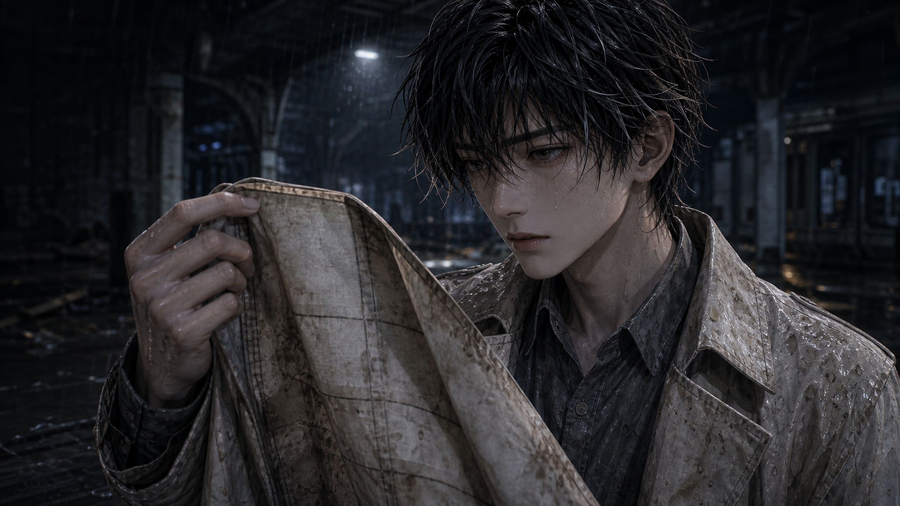

图片路径：

```text
F:\CodexSharedCockpit\episodes\season_01\episode_02\keyframes\ep02_director_v3\EP02-OP01-3_澜冰屿发现坐标布条变白_关键帧_v3.png
```

图生视频 Prompt：

```text
雨夜旧北站外侧，冷灰蓝废街，雨水落在破损地面形成反光。以关键帧构图为准，澜冰屿从旧北站冷雾里走出后停住，他意识到自己走向了错误出口。镜头从中景极慢推近到手部，澜冰屿低头打开米白旧长外套内侧，手指摸向几条不可读坐标布条，其中一条正在褪成空白。澪星在他身旁先停下并回头，尾部青蓝引航灯轻轻亮起，像是在提醒正确方向。澜冰屿的表情是第一集之后的疲惫、余痛和不安，不惊慌，不奔跑。雨声压低，远处出现一次短促取证终端电子提示，暗示有人捕捉到 B-07 信号。镜头运动克制，保持冷灰蓝雨夜、湿地反光和低雾氛围。
```

负面约束：

```text
不要小夏和妈妈，不要阳光车站，不要第一集事故大厅，不要澜冰屿变成长发银发，不要澪星动物化，不要可读长文字，不要字幕。
```

---

## 02｜EP02-OP02-1 陆衡雨夜登场

覆盖分镜：EP02-OP02-1、EP02-OP02-2  
建议时长：4-5 秒  
节奏：低压，人物登场要有压迫感，但不是英雄出场。

关键帧图片：

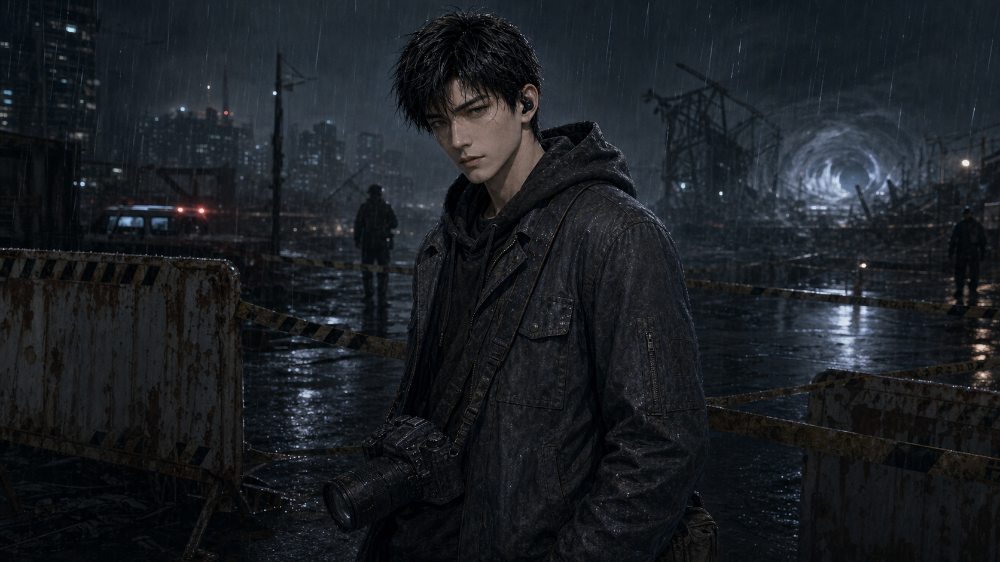

图片路径：

```text
F:\CodexSharedCockpit\episodes\season_01\episode_02\keyframes\ep02_director_v3\EP02-OP02-1_陆衡雨夜登场_关键帧_v3.png
```

图生视频 Prompt：

```text
陆衡站在异常区外围雨夜封锁线外，深灰蓝短款调查夹克被雨水打湿，黑色连帽内搭贴近颈部，旧相机包斜挎在身侧。以半身中景开始，镜头缓慢推近他的眼神。陆衡低头查看手腕旧式取证终端，终端发出微弱冷蓝光，然后他的手伸向旧相机包。表演重点是疲惫、压抑、长期寻找妹妹后终于锁定线索的冷意；不是耍帅，不是英雄登场。右耳黑色骨传导通讯器和右眼下浅伤要清楚，自然分束雨湿黑色短发保持 V3 选定发型，眼睛不被遮住。背景是冷灰蓝雨夜废街、封锁线、低雾和金属雨声。
```

负面约束：

```text
不要警察制服，不要枪，不要特警装备，不要英雄仰拍，不要油头、寸头、刺发或硬侧分，不要把陆衡画成中年人。
```

---

## 03｜EP02-OP02-4 损坏记忆卡投影妹妹

覆盖分镜：EP02-OP02-2 至 EP02-OP02-5  
建议时长：5-6 秒  
节奏：从现实道具转入情感裂口，投影必须断裂。

关键帧图片：

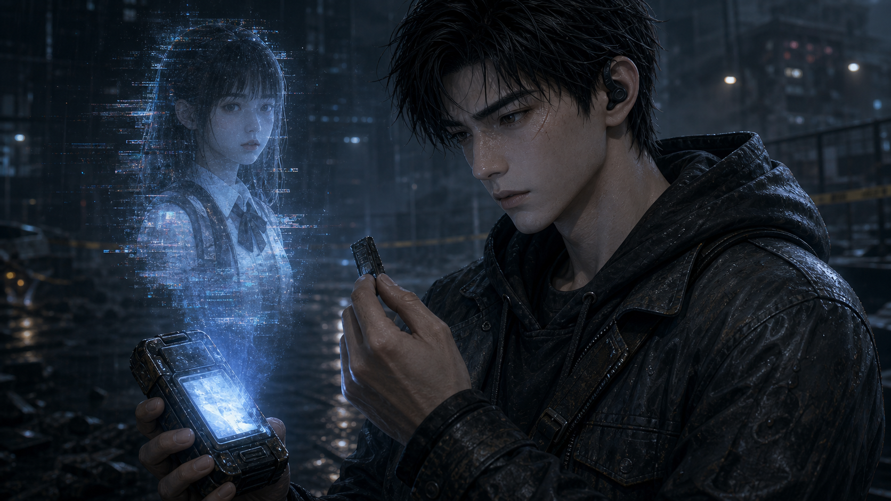

图片路径：

```text
F:\CodexSharedCockpit\episodes\season_01\episode_02\keyframes\ep02_director_v3\EP02-OP02-4_损坏记忆卡投影妹妹_关键帧_v3.png
```

图生视频 Prompt：

```text
陆衡打开旧相机包，包内侧贴着一张妹妹旧照片，照片边缘被透明胶带反复加固，只露出短短一瞬。随后他把损坏记忆卡插入手腕旧式取证终端，接口发出轻微金属声和电子杂音。蓝灰色投影噪点开始闪烁，陆星遥的半透明断裂影像在终端上方出现，画面缺损、边缘破碎、帧率不稳定。她像是在对哥哥说“别进来”，但影像不断断线。陆衡伸手想触碰投影，手指停在半空，没有碰到任何实体。镜头从道具近景慢慢转到陆衡侧脸，让观众看见他的疲惫和忍住的情绪。陆星遥不能完整实体化，只能是残缺投影和断续残音。
```

负面约束：

```text
不要让妹妹变成完整实体人物，不要清晰长时间露脸，不要温馨家庭回忆大闪回，不要把终端画成炫酷科幻武器，不要可读大段文字。
```

---

## 04｜EP02-OP03-2 陆衡与澜冰屿第一次对峙

覆盖分镜：EP02-OP03-1 至 EP02-OP03-5  
建议时长：6-7 秒  
节奏：悬疑对峙，冲突靠视线和证据，不靠打斗。

关键帧图片：

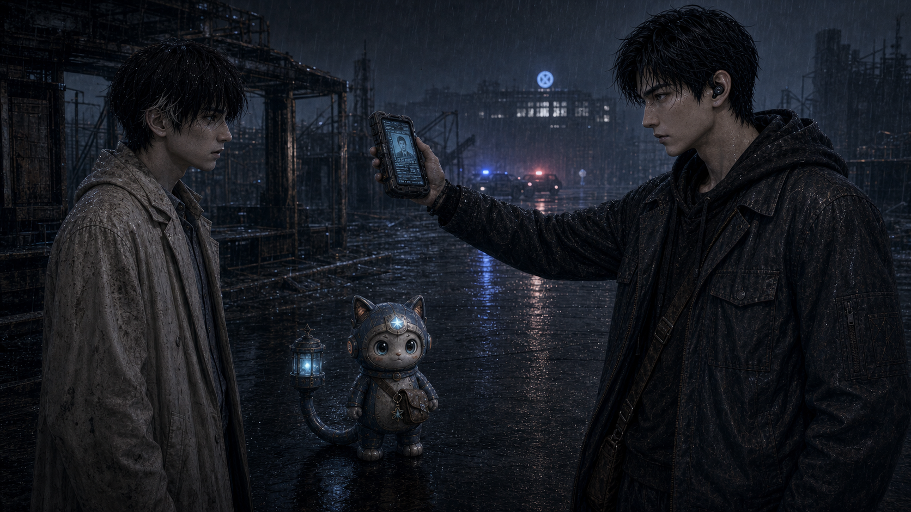

图片路径：

```text
F:\CodexSharedCockpit\episodes\season_01\episode_02\keyframes\ep02_director_v3\EP02-OP03-2_陆衡与澜冰屿第一次对峙_关键帧_澪星修正版.png
```

图生视频 Prompt：

```text
雨夜废街，平视双人对峙构图。陆衡从废弃公交站牌后走出，站在画面一侧，手腕终端垂在胸前，不像武器，只像取证工具；澜冰屿站在另一侧，苍白疲惫但没有后退。澪星靠近澜冰屿，站在两人之间偏低位置，尾灯微亮，形成一条小小的青蓝边界。陆衡质问澜冰屿身份，随后举起损坏记忆卡，证据压迫感来自卡片和终端光，不来自暴力。澜冰屿听见陆星遥残音时，眼神短暂失焦，极细蓝色环形瞳孔微亮，脸色更白。镜头保持克制，可轻微横移或慢推，重点是两人剪影差异：澜冰屿低头防御，陆衡向前压迫。不要打斗，不要推搡。
```

负面约束：

```text
不要让两人长得一样，不要只靠衣服区分，不要陆衡拿枪，不要澜冰屿英雄化，不要澪星变成宠物猫，不要夸张动作片运镜。
```

---

## 05｜EP02-OP04-1 废弃派出所从雨雾中出现

覆盖分镜：EP02-OP04-1 至 EP02-OP04-4  
建议时长：5-6 秒  
节奏：空间漂移，像边界自己打开。

关键帧图片：

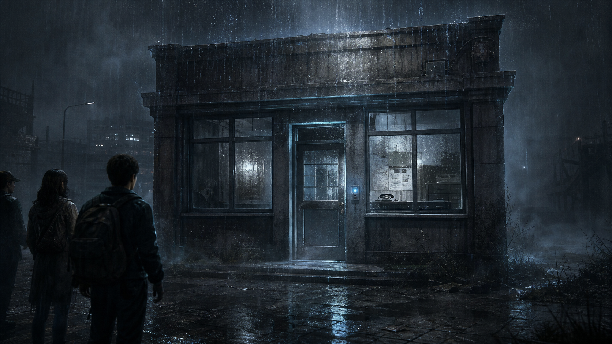

图片路径：

```text
F:\CodexSharedCockpit\episodes\season_01\episode_02\keyframes\ep02_director_v3\EP02-OP04-1_废弃派出所从雨雾中出现_关键帧_v3.png
```

图生视频 Prompt：

```text
雨夜街道出现边界漂移，废弃派出所入口从冷雾里缓慢显形。门禁位置亮起一瞬灰蓝回声光，窗内隐约浮现旧电话轮廓。镜头先是建筑远景，然后轻微推近门禁小光点。远处公交站牌和街道墙面被雾吞没，空间像在轻轻后退和重排，不能夸张成魔法漩涡。陆衡听见妹妹残音后从画面边缘急促冲向门口，澜冰屿伸手想阻止但晚了一步，手停在半空。整体是成熟悬疑，不是恐怖鬼屋；雨声、旧电话铃一声、空间低频拉伸声作为氛围。
```

负面约束：

```text
不要鬼屋恐怖感，不要血手印，不要现代明亮派出所，不要大段招牌文字，不要空间爆炸，不要魔法光柱。
```

---

## 06｜EP02-OP05-1 未接来电大厅电话亮起

覆盖分镜：EP02-OP05-1 至 EP02-OP05-4  
建议时长：6-7 秒  
节奏：空旷压迫，电话铃像未被接住的求助。

关键帧图片：

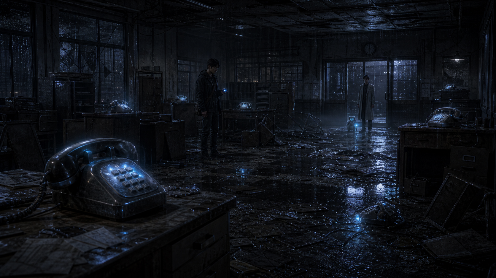

图片路径：

```text
F:\CodexSharedCockpit\episodes\season_01\episode_02\keyframes\ep02_director_v3\EP02-OP05-1_未接来电大厅电话亮起_关键帧_v3.png
```

图生视频 Prompt：

```text
废弃派出所接警大厅内部，大全景，桌椅翻倒，地面积水，旧电话散落在办公桌和地面边缘。镜头从前景一部旧电话缓慢滑过，多部电话依次亮起微弱蓝灰光，积水里出现电话光的反射。陆衡站在中景查看手腕终端，澜冰屿在入口处停住，被许多失踪者家属低语压住，澪星尾灯保持微弱青蓝光。电话铃不是刺耳恐怖，而像很多长期没人接通的求助，层层叠起。陆衡侧脸近景可以短暂出现，他说“我只找她”的情绪是执念和疲惫，不是冷血。保持大厅破败、潮湿、冷灰蓝、旧设备质感。
```

负面约束：

```text
不要现代办公室，不要明亮警局，不要恐怖鬼脸，不要血腥，不要电话飞起，不要屏幕可读长文，不要热闹人群。
```

---

## 07｜EP02-OP06-3 妹妹投影看向澜冰屿

覆盖分镜：EP02-OP06-1 至 EP02-OP06-5  
建议时长：6-7 秒  
节奏：本集第一个强悬疑钩子，必须看懂“她看见澜冰屿”。

关键帧图片：

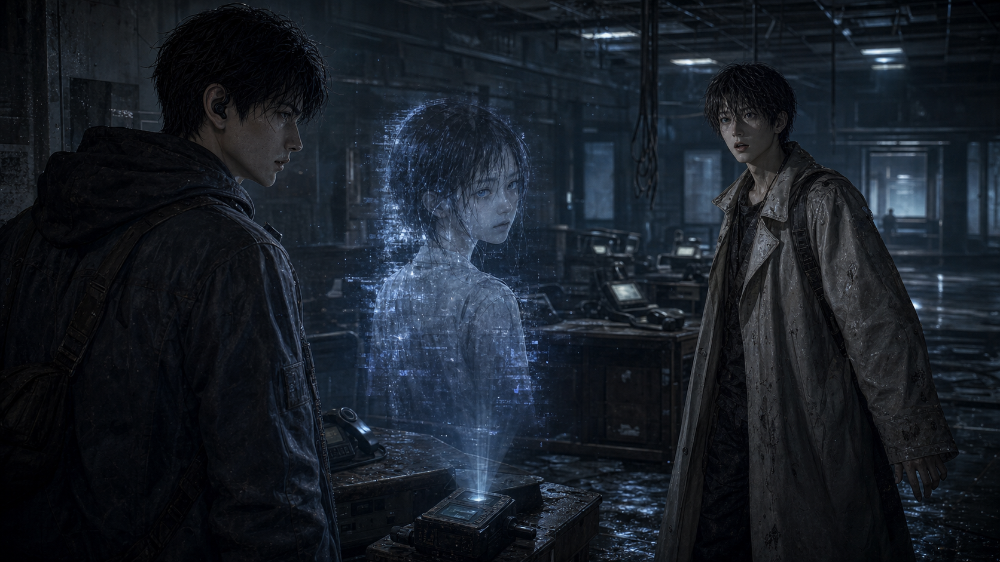

图片路径：

```text
F:\CodexSharedCockpit\episodes\season_01\episode_02\keyframes\ep02_director_v3\EP02-OP06-3_妹妹投影看向澜冰屿_关键帧_v3.png
```

图生视频 Prompt：

```text
陆星遥的断裂投影从陆衡终端上方出现，背景像白色应急走廊的残缺影像，画面有噪点、断线和破碎光带。陆衡伸手想触碰妹妹投影，手穿过光影，投影轻轻抖动。投影一开始像是在看哥哥，随后缓慢转头，视线越过陆衡，看向后方的澜冰屿。镜头要通过反打清楚表达：投影看的不是陆衡，而是澜冰屿。澜冰屿被看见的一瞬间后退半步，蓝环瞳孔微亮，脸色变白；陆衡捕捉到这个反应，表情从悲伤转为质问。最后可以停在陆衡抓住澜冰屿衣领前的压迫瞬间，但不要打斗。投影必须保持残缺，不完整实体化。
```

负面约束：

```text
不要妹妹完整实体登场，不要变成普通少女站在现场，不要恐怖鬼脸，不要澜冰屿夸张尖叫，不要陆衡暴力殴打，不要魔法爆炸。
```

---

## 08｜EP02-OP07-3 澜冰屿按住伪造记录屏幕

覆盖分镜：EP02-OP07-1 至 EP02-OP07-4  
建议时长：5-6 秒  
节奏：证据被系统伪造，澜冰屿靠“情绪辨认”拆穿。

关键帧图片：

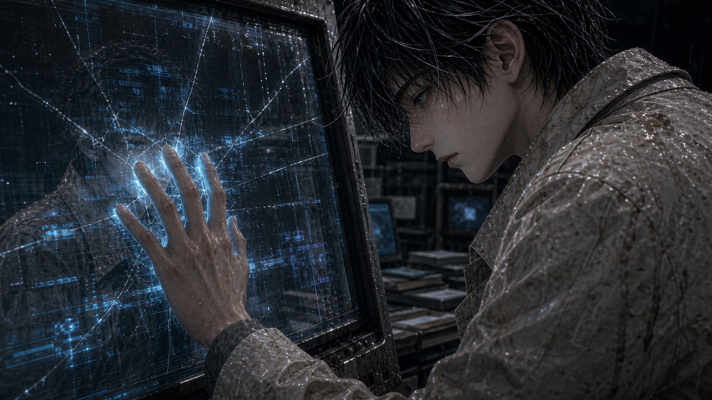

图片路径：

```text
F:\CodexSharedCockpit\episodes\season_01\episode_02\keyframes\ep02_director_v3\EP02-OP07-3_澜冰屿按住伪造记录屏幕_关键帧_v3.png
```

图生视频 Prompt：

```text
旧屏幕亮起伪造案件关闭记录，文字必须模糊不可读，只保留“系统界面”和短促标识的感觉。陆衡脸映在屏幕旁，他被这份看似完整的证据击中，手指微微发抖。澜冰屿走近，把手按在破裂屏幕上，屏幕冷光照亮他苍白的侧脸。他低声判断这份记录没有真实痛感。随后屏幕里整齐的记录开始裂成抽象声纹和噪声，陆星遥残音浮出，像在说记录是假的。镜头重点是手按屏幕、陆衡被证据击中、伪造记录裂开；不要做魔法爆炸，只做屏幕裂纹、噪声和声纹变化。
```

负面约束：

```text
不要可读大段案件文字，不要字幕，不要屏幕爆炸，不要魔法阵，不要澜冰屿英雄化，不要陆衡暴怒砸屏。
```

---

## 09｜EP02-OP08-1 陆衡递出损坏记忆卡

覆盖分镜：EP02-OP08-1、EP02-OP08-2  
建议时长：4-5 秒  
节奏：不信任的交接，动作要慢。

关键帧图片：

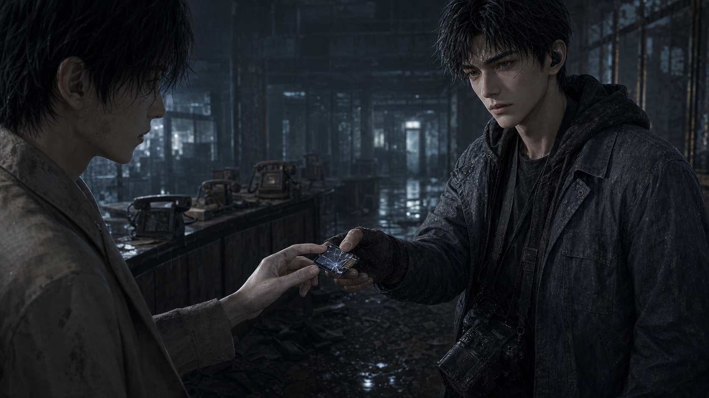

图片路径：

```text
F:\CodexSharedCockpit\episodes\season_01\episode_02\keyframes\ep02_director_v3\EP02-OP08-1_陆衡递出损坏记忆卡_关键帧_v3.png
```

图生视频 Prompt：

```text
双手近景，损坏记忆卡位于画面中心。陆衡把记忆卡递给澜冰屿，但手指没有完全松开；澜冰屿伸手接住卡片另一侧，两人的手短暂停住，形成不信任的桥。背景旧电话、破碎屏幕和湿地反光虚化。镜头极慢推近卡片和指尖，环境声逐渐变低，电话铃声像被抽走。澜冰屿指尖触到记忆卡的一瞬间，接警大厅所有电话突然静音。两人都不要做夸张表情，信任还没建立，只是被迫共同面对证据。
```

负面约束：

```text
不要握手和解，不要拥抱，不要卡片变成魔法宝石，不要大光爆，不要可读长文字，不要两人脸型混淆。
```

---

## 10｜EP02-OP08-4 澪星稳定澜冰屿影子

覆盖分镜：EP02-OP08-3 至 EP02-OP08-5  
建议时长：6-7 秒  
节奏：代价显现，澪星保护，第二集情感支点。

关键帧图片：

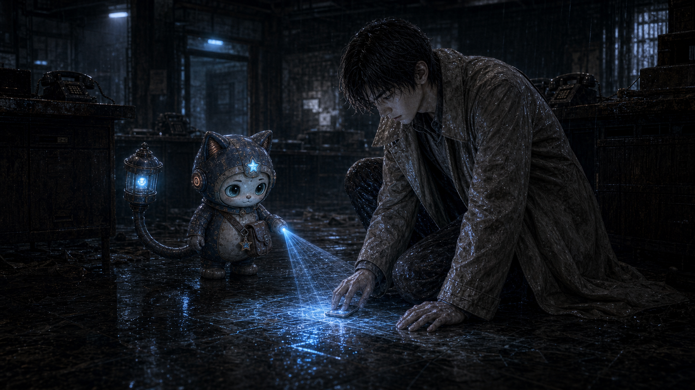

图片路径：

```text
F:\CodexSharedCockpit\episodes\season_01\episode_02\keyframes\ep02_director_v3\EP02-OP08-4_澪星稳定澜冰屿影子_关键帧_澪星修正版.png
```

图生视频 Prompt：

```text
澜冰屿触碰记忆卡后身体一沉，蓝环瞳孔微亮，外套内侧坐标布条又有一段变白。所有旧电话突然静音，整个大厅像被抽走空气。澪星贴近澜冰屿腿边，用尾部青蓝引航灯压向湿地，光像水纹一样扩散，稳定澜冰屿被拉长、轻微变形的影子。陆衡站在后方看到这一切，第一次动摇，表情从质问变成不安。镜头可以从低机位慢慢推近澪星尾灯和影子，再抬到澜冰屿疲惫的脸。澪星必须保持 V2 机械引航生命形态：雾蓝/月灰蓝硬质外壳、象牙白脸腹、青蓝玻璃质大眼、额头星核、橙色耳部信号灯、斜挎愿望舱包、尾部引航灯。不要动物化。
```

负面约束：

```text
不要把澪星画成真实猫、普通猫、动物、毛绒玩具、儿童玩具或吉祥物，不要猫毛、猫爪肉垫、胡须，不要澜冰屿漂浮飞起，不要魔法少女光效。
```

---

## 11｜EP02-OP09-4 记忆卡向澜冰屿发光

覆盖分镜：EP02-OP09-1 至 EP02-OP09-4  
建议时长：5-6 秒  
节奏：小单元释放后，主线钩子反而更强。

关键帧图片：

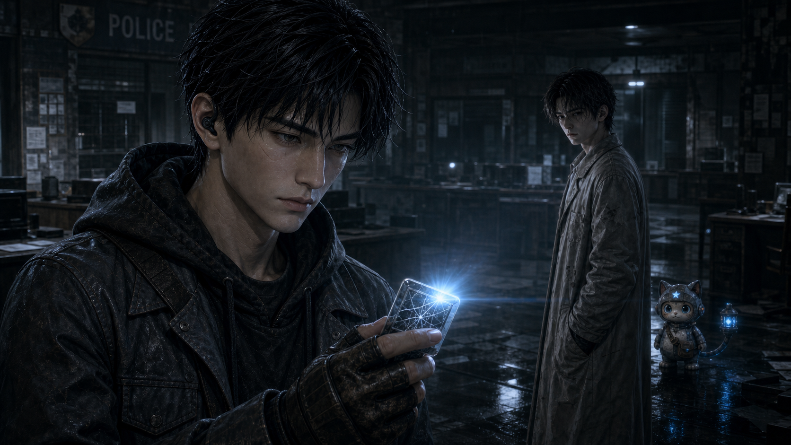

图片路径：

```text
F:\CodexSharedCockpit\episodes\season_01\episode_02\keyframes\ep02_director_v3\EP02-OP09-4_记忆卡向澜冰屿发光_关键帧_澪星修正版.png
```

图生视频 Prompt：

```text
接警大厅异常开始释放，许多模糊家属残影逐渐安静，旧电话一部一部熄灭，电话声逐个停止。陆衡将“案件关闭”标记为伪造后，现实调查能力成立，但情绪没有真正松开。他收回损坏记忆卡，却发现记忆卡没有熄灭，反而朝澜冰屿方向发出更明显的微弱蓝光。镜头从记忆卡近景缓慢拉到澜冰屿，澜冰屿站在虚化背景里，苍白、疲惫、沉默。陆衡不说话，眼神从愤怒变成更深的不安。这个镜头的核心是“妹妹线索指向澜冰屿”，不是解决问题。
```

负面约束：

```text
不要让残影恐怖化，不要大团鬼影，不要卡片强烈爆光，不要澜冰屿变成反派，不要陆衡突然和解，不要可读屏幕文字。
```

---

## 12｜EP02-OP10-3 陆衡要求澜冰屿不能消失

覆盖分镜：EP02-OP10-1 至 EP02-OP10-3  
建议时长：5-6 秒  
节奏：从敌对转临时绑定，不能太快和解。

关键帧图片：

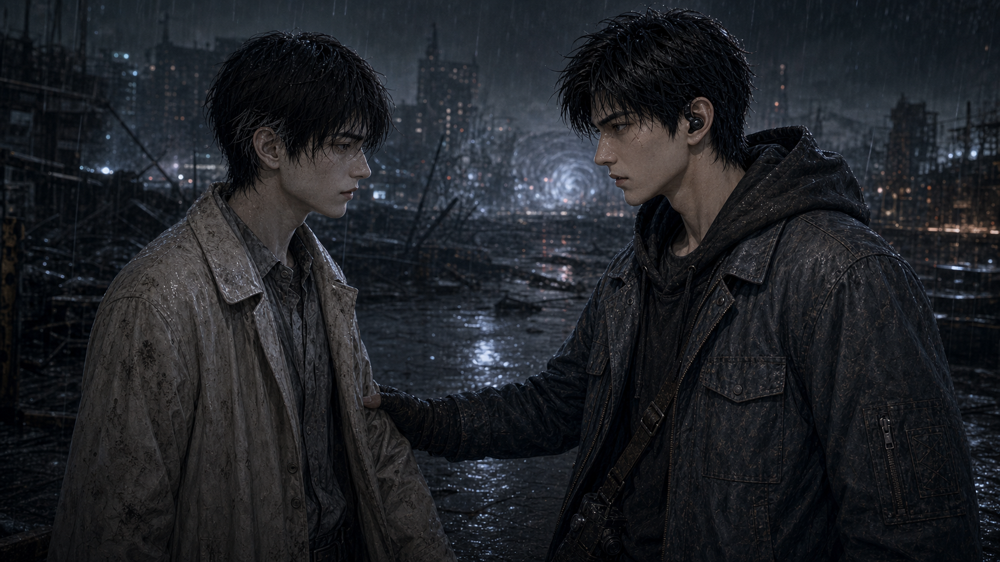

图片路径：

```text
F:\CodexSharedCockpit\episodes\season_01\episode_02\keyframes\ep02_director_v3\EP02-OP10-3_陆衡要求澜冰屿不能消失_关键帧_v3.png
```

图生视频 Prompt：

```text
雨夜街区恢复，废弃派出所从身后雾里消失，雨声重新压回现实。陆衡和澜冰屿平视对峙，构图稳定，距离不近不远。陆衡把损坏记忆卡收起，但手没有完全放松，他低声要求：在查清妹妹和澜冰屿的关系之前，澜冰屿不能消失。澜冰屿没有反驳，只是疲惫地看着他，像已经习惯被误解。澪星站在两人中间偏后，尾灯很低，像在观察这段临时绑定关系。镜头可以从双人中景慢慢推近到两人眼神，但不要拥抱，不要握手，不要和解太快。
```

负面约束：

```text
不要两人变成朋友式微笑，不要拥抱，不要握手，不要陆衡暴力威胁，不要澜冰屿英雄宣言，不要澪星动物化。
```

---

## 13｜EP02-OP10-4 B-07 未归还记忆碎片警告

覆盖分镜：EP02-OP10-4、EP02-OP10-5  
建议时长：5-6 秒  
节奏：结尾钩子，信息一闪即过，留悬念。

关键帧图片：

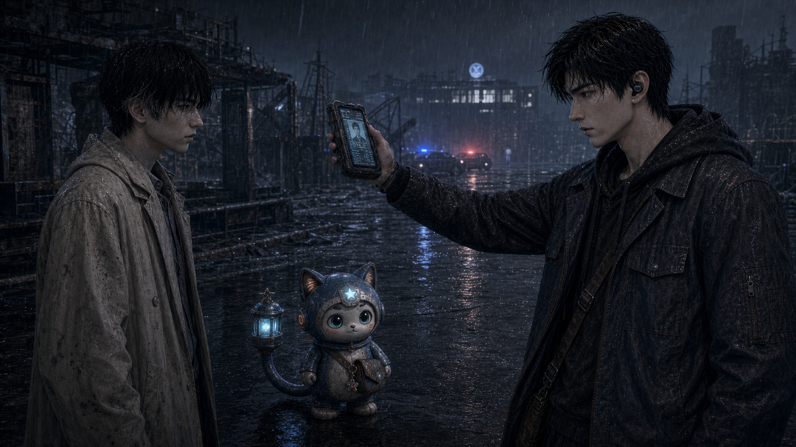

图片路径：

```text
F:\CodexSharedCockpit\episodes\season_01\episode_02\keyframes\ep02_director_v3\EP02-OP10-4_B07未归还记忆碎片警告_关键帧_澪星修正版.png
```

图生视频 Prompt：

```text
雨夜街区，陆衡转身向前，没有看见远处损坏屏幕短暂亮起的冷蓝警告。澜冰屿和澪星同时停住，看向那道冷蓝光。屏幕内容不能清楚可读，只能短暂出现 B-07-like 标识、抽象警示界面和碎片化扫描线，暗示“未归还记忆碎片”。澜冰屿意识到自己体内可能有不属于自己的记忆，表情压住恐惧，不说破。澪星尾灯微亮，像在确认危险。最后三人背影朝异常区更深处走去，雨声逐渐压暗，画面入黑。结尾要让观众想看第三集：妹妹陆星遥为什么认识 B-07，澜冰屿体内到底有什么。
```

负面约束：

```text
不要让屏幕文字清楚可读，不要长句字幕，不要解释完整真相，不要陆衡看见全部信息，不要大爆炸，不要结尾阳光化，不要把悬疑钩子讲透。
```


